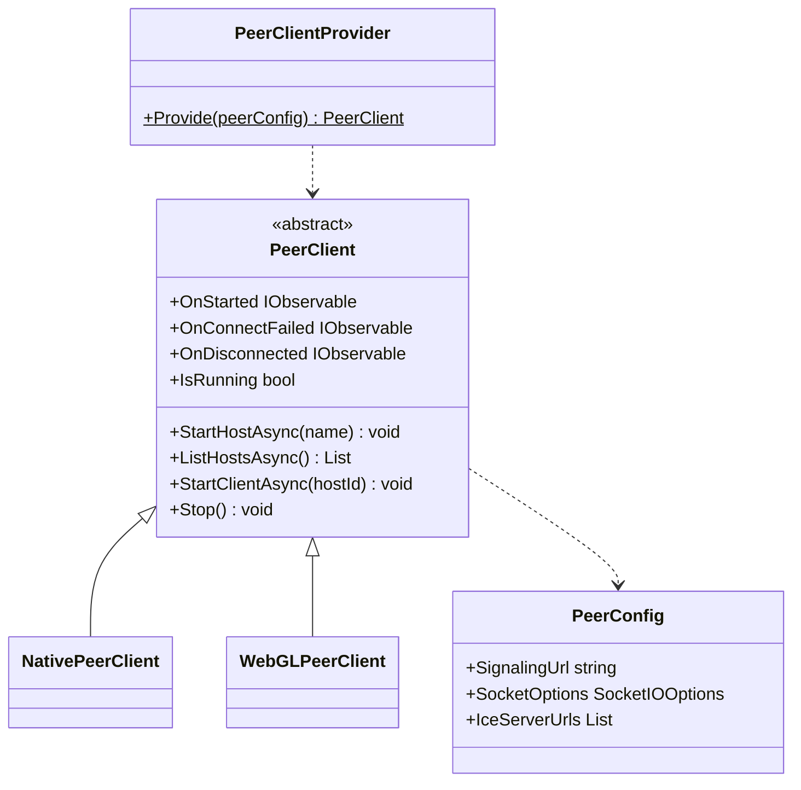
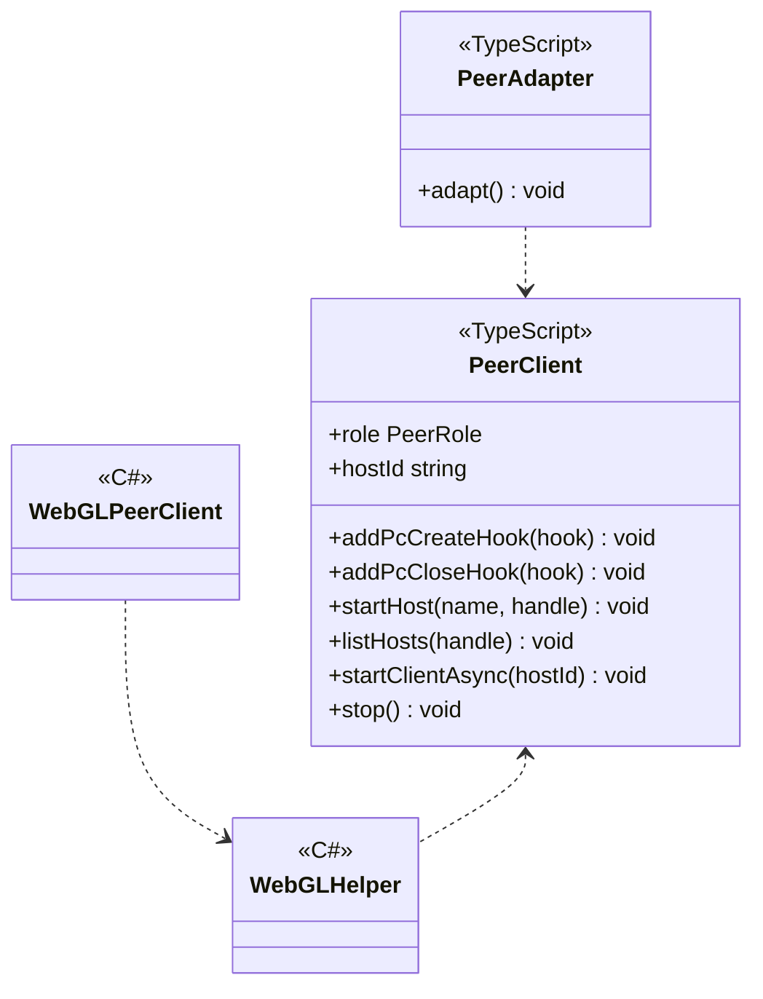
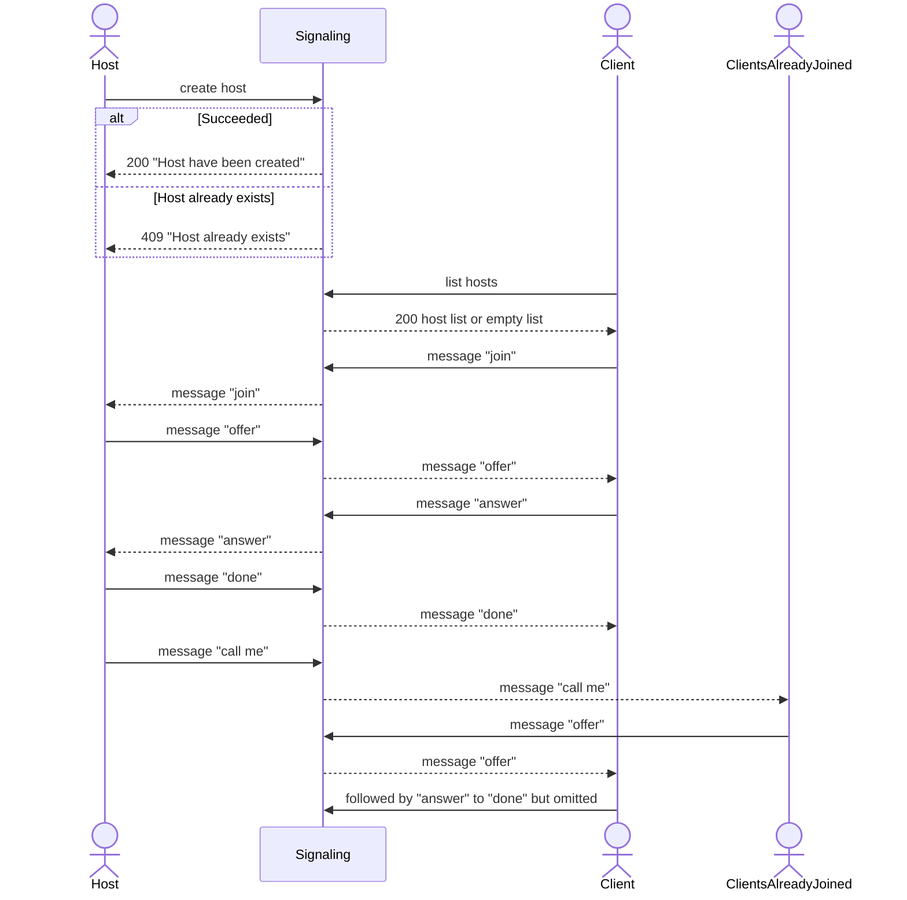

---
sidebar_position: 5
---

# P2P using WebRTC

## What for?

P2P(Peer to Peer) is a means of communicating in virtual spaces, etc., with the lowest possible cost.

P2P can be realized relatively easily by using WebRTC, but since P2P connection establishment is a similar processing, it is provided as a common feature.
By using this common feature, application-specific P2P can be realized by simply adding data channel and media stream processing.

This module provides base P2P features for Native(C#) and WebGL(JavaScript).

## Specification

- You can establish a host/client P2P connection.
- You can add processing to trigger P2P state.
- You can add application-specific processing to Native(C#) P2P.
- You can add application-specific processing to WebGL(JavaScript) P2P

## Architecture

### Unity



### JavaScript



In P2P, the application and the signaling server cooperate to establish a P2P connection.
In order to establish a P2P connection, this module provides a feature that assumes the following processing flow.
When one user becomes a host and another user joins the host, a P2P connection is established with the host and the users already joined to the host.



:::info
This module uses Vanilla ICE, which has simple logic, for WebRTC route information gathering.
Vanilla ICE waits for all the route information gathering to be completed, so it may take a long time (e.g., 40 seconds) depending on the network environment.
Since there is a high possibility that a connection can be established without waiting for all the routing information to be gathered, this module provides a timeout for Vanilla ICE to stop route information gathering after a short period of time.
The default is 5 seconds. this timeout can be changed using PeerConfig.
:::

## Installation

### Package

#### Unity
```text
https://github.com/extreal-dev/Extreal.Integration.P2P.WebRTC.git
```

#### npm
```text
@extreal-dev/extreal.integration.p2p.webrtc
```

### Dependencies

This module uses the following packages.

#### Unity

- [Extreal.Core.Logging](../core/logging.md)
- [Extreal.Core.Common](../core/common.md)
- [Extreal.Integration.Web.Common](../integration/web.common.md)
- [Collections](https://docs.unity3d.com/Packages/com.unity.collections@1.2/manual/index.html)
- [WebRTC](https://docs.unity3d.com/Packages/com.unity.webrtc@3.0/manual/index.html)
- [UniTask](https://github.com/Cysharp/UniTask)
- [UniRx](https://github.com/neuecc/UniRx)
- [System.Text.Json](https://learn.microsoft.com/ja-jp/dotnet/api/system.text.json)
- [SocketIOClient](https://github.com/doghappy/socket.io-client-csharp)

#### npm

- [@extreal-dev/extreal.integration.web.common](https://www.npmjs.com/package/@extreal-dev/extreal.integration.web.common)
- [socket.io-client](https://www.npmjs.com/package/socket.io-client)

### Settings

#### Signaling server

Signaling server is provided by [Docker Compose](https://docs.docker.com/compose/).
Please refer to [README](https://github.com/extreal-dev/Extreal.Integration.P2P.WebRTC/tree/main/SignalingServer~) to prepare your signaling server.

#### Application

Create a PeerClient using PeerClientProvider.
Specify the URL of the signaling server when creating the PeerClient.

```csharp
public class ClientControlScope : LifetimeScope
{
    protected override void Configure(IContainerBuilder builder)
    {
        var peerConfig = new PeerConfig("http://127.0.0.1:3010");
        var peerClient = PeerClientProvider.Provide(peerConfig);
        builder.RegisterComponent(peerClient);
    }
}
```

If you want to use it with WebGL, initialize it further with JavaScript.
Create a PeerAdapter and call the adapt function.

```typescript
import { PeerAdapter } from "@extreal-dev/extreal.integration.p2p.webrtc";

const peerAdapter = new PeerAdapter();
peerAdapter.adapt();
```

:::info
For a development environment using TypeScript, please refer to [sample](https://github.com/extreal-dev/Extreal.Integration.P2P.WebRTC/tree/main/Samples~/MVS/WebGLScripts~) in this module.
:::

## Usage

### Establish a host/client P2P connection {#p2p-webrtc-host-client}

This module provides host/client oriented features to establish a P2P connection.
These features are provided by PeerClient.

First, create a host by specifying a name.
The user who created it becomes the host.
If the name is duplicated, a HostNameAlreadyExistsException is thrown.

```csharp
await peerClient.StartHostAsync("host name");
```

The client(user who wants to join a host) gets a list of hosts.

```csharp
var hosts = await peerClient.ListHostsAsync();
```

A list of Hosts with their Id and Name is returned, and the client joins the Host using the Host's Id obtained here.
The client requests to join a host and establishes a P2P connection with the host and other clients that have already joined the host.

```csharp
await peerClient.StartClientAsync(hostId);
```

If the host is shut down or the client leaves the host, the P2P connection is stopped.

```csharp
peerClient.Stop();
```

### Add processing to trigger P2P state

PeerClient has the following event notifications

- OnStarted
    - Timing: Immediately after the host or client starts
        - Host
            - Immediately after the host is created
        - Client
            - Immediately after all of the following conditions are met
                - Receives "done" from the host
                - IceConnectionState becomes Connected or Completed
    - Type: IObservable
    - Parameters: None
- OnStartFailed
    - Timing: Immediately after host or client failed to start
        - If the start processing times out, the start is assumed to have failed.
        - The default timeout is 15 seconds. The timeout can be changed using PeerConfig.
    - Type: IObservable
    - Parameters: None
- OnConnectFailed
    - Timing: Immediately after the host or client has failed to connect to the signaling server
    - Type: IObservable
    - Parameters: Reason for connection failure
- OnDisconnected
    - Timing: Immediately after a host or client connected to the signaling server is disconnected
    - Type: IObservable
    - Parameters: Reason for disconnection

### Add application-specific processing to Native(C#) P2P

:::caution
Processing continues even if errors occur during Create/Close of PeerConnection.
:::

PeerClient has hooks that can add processing at the start and end of a P2P connection.

```csharp
peerClient.AddPcCreateHook((id, isOffer, rtcPeerConnection) =>
{
    // do something
});

peerClient.AddPcCloseHook((id) =>
{
    // do something
});
```

These hooks are used to add application-specific features to P2P by manipulating data channels and media streams.
An example implementation for creating a data channel is as follows.

```csharp
#if !UNITY_WEBGL || UNITY_EDITOR
using System.Collections.Generic;
using System.Linq;
using System.Text;
using Extreal.Core.Logging;
using Unity.WebRTC;

namespace Extreal.Integration.P2P.WebRTC.MVS.ClientControl
{
    public class NativeDataChannelClient : DataChannelClient
    {
        private static readonly ELogger Logger = LoggingManager.GetLogger(nameof(NativeDataChannelClient));

        private static readonly string Label = "sample";

        private readonly Dictionary<string, RTCDataChannel> dcDict;

        public NativeDataChannelClient(NativePeerClient peerClient)
        {
            dcDict = new Dictionary<string, RTCDataChannel>();
            peerClient.AddPcCreateHook(CreatePc);
            peerClient.AddPcCloseHook(ClosePc);
        }

        private void CreatePc(string id, bool isOffer, RTCPeerConnection pc)
        {
            if (dcDict.ContainsKey(id))
            {
                return;
            }

            if (isOffer)
            {
                var dc = pc.CreateDataChannel(Label);
                HandleDc(id, dc);
            }
            else
            {
                pc.OnDataChannel += (dc) => HandleDc(id, dc);
            }
        }

        private void HandleDc(string id, RTCDataChannel dc)
        {
            if (dc.Label != Label)
            {
                return;
            }

            if (Logger.IsDebug())
            {
                Logger.LogDebug($"New DataChannel: id={id} label={dc.Label}");
            }

            dcDict.Add(id, dc);
            dc.OnMessage = message => Logger.LogDebug(Encoding.UTF8.GetString(message));
        }

        private void ClosePc(string id)
        {
            if (!dcDict.TryGetValue(id, out var dc))
            {
                return;
            }
            dc.Close();
            dcDict.Remove(id);
        }

        public override void Clear()
        {
            dcDict.Keys.ToList().ForEach(ClosePc);
            dcDict.Clear();
        }
    }
}
#endif
```

### Add application-specific processing to WebGL(JavaScript) P2P

:::caution
Processing continues even if errors occur during Create/Close of PeerConnection.
:::

WebGL(JavaScript) is a bit more extensive than Native(C#) because it requires C# and JavaScript to work together.
The mechanism is the same as Native(C#), using hooks to add application-specific processing to P2P.

An example implementation for creating a data channel is shown below.
The major difference is that the PeerClient is obtained from the PeerClientProvider function.

```typescript
import { PeerClientProvider } from "@extreal-dev/extreal.integration.p2p.webrtc";

class DataChannelClient {
    private readonly label: string = "sample";
    private readonly isDebug: boolean;
    private readonly dcMap: Map<string, RTCDataChannel>;
    private readonly getPeerClient: PeerClientProvider;

    constructor(getPeerClient: PeerClientProvider) {
        this.isDebug = true;
        this.dcMap = new Map();
        this.getPeerClient = getPeerClient;
        this.getPeerClient().addPcCreateHook(this.createPc);
        this.getPeerClient().addPcCloseHook(this.closePc);
    }

    private createPc = (id: string, isOffer: boolean, pc: RTCPeerConnection) => {
        if (this.dcMap.has(id)) {
            return;
        }

        if (isOffer) {
            const dc = pc.createDataChannel(this.label);
            this.handleDc(id, dc);
        } else {
            pc.addEventListener("datachannel", (event) => this.handleDc(id, event.channel));
        }
    };

    private handleDc = (id: string, dc: RTCDataChannel) => {
        if (dc.label !== this.label) {
            return;
        }

        if (this.isDebug) {
            console.log(`New DataChannel: id=${id} label=${dc.label}`);
        }

        this.dcMap.set(id, dc);
    };

    private closePc = (id: string) => {
        const dc = this.dcMap.get(id);
        if (!dc) {
            return;
        }
        dc.close();
        this.dcMap.delete(id);
    };

    public clear = () => {
        [...this.dcMap.keys()].forEach(this.closePc);
        this.dcMap.clear();
    };
}

export { DataChannelClient };
```

PeerClientProvider is provided by PeerAdapter, which appeared in [Settings](#settings).
PeerAdapter holds PeerClient internally and defines the interaction between C# and JavaScript.

To do P2P with WebGL, first create a PeerAdapter and call its adapt function.
Then, use the getPeerClient function of the PeerAdapter to add application-specific processing like the DataChannelClient described earlier.

The timing of calling application-specific processing is important here.
Be careful not to initialize the processing added by the application (in this case, DataChannelClient) before PeerClient in C#.
The C# PeerClient is initialized at the timing when the Provide method of PeerClientProvider is called.

Use [Web.Common](web.common.md) to control the timing of the call from C#.

```typescript
import { addAction } from "@extreal-dev/extreal.integration.web.common";
import { PeerAdapter } from "@extreal-dev/extreal.integration.p2p.webrtc";
import { DataChannelClient } from "./DataChannelClient";

const peerAdapter = new PeerAdapter();
peerAdapter.adapt();

let dataChannelClient: DataChannelClient;
addAction("start", () => dataChannelClient = new DataChannelClient(peerAdapter.getPeerClient));
addAction("clear", () => dataChannelClient.clear);
```

Create a C# caller.
Use WebGLHelper in [Web.Common](web.common.md).

```csharp
using Extreal.Integration.Web.Common;

namespace Extreal.Integration.P2P.WebRTC.MVS.ClientControl
{
    public class WebGLDataChannelClient : DataChannelClient
    {
        public WebGLDataChannelClient() => WebGLHelper.CallAction("start");

        public override void Clear() => WebGLHelper.CallAction("clear");
    }
}
```
