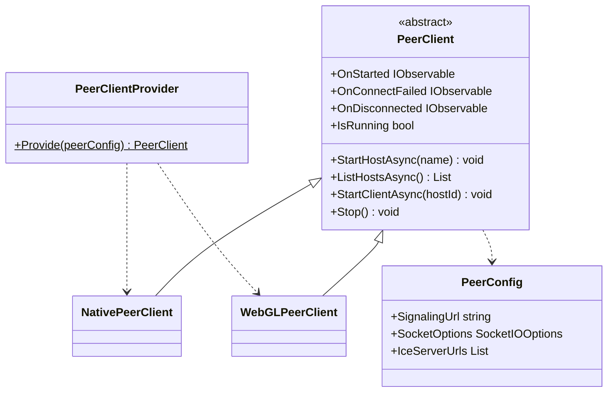
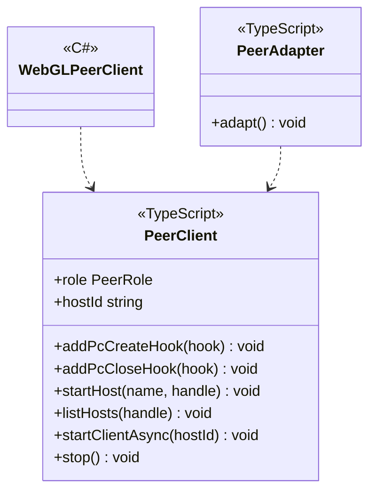
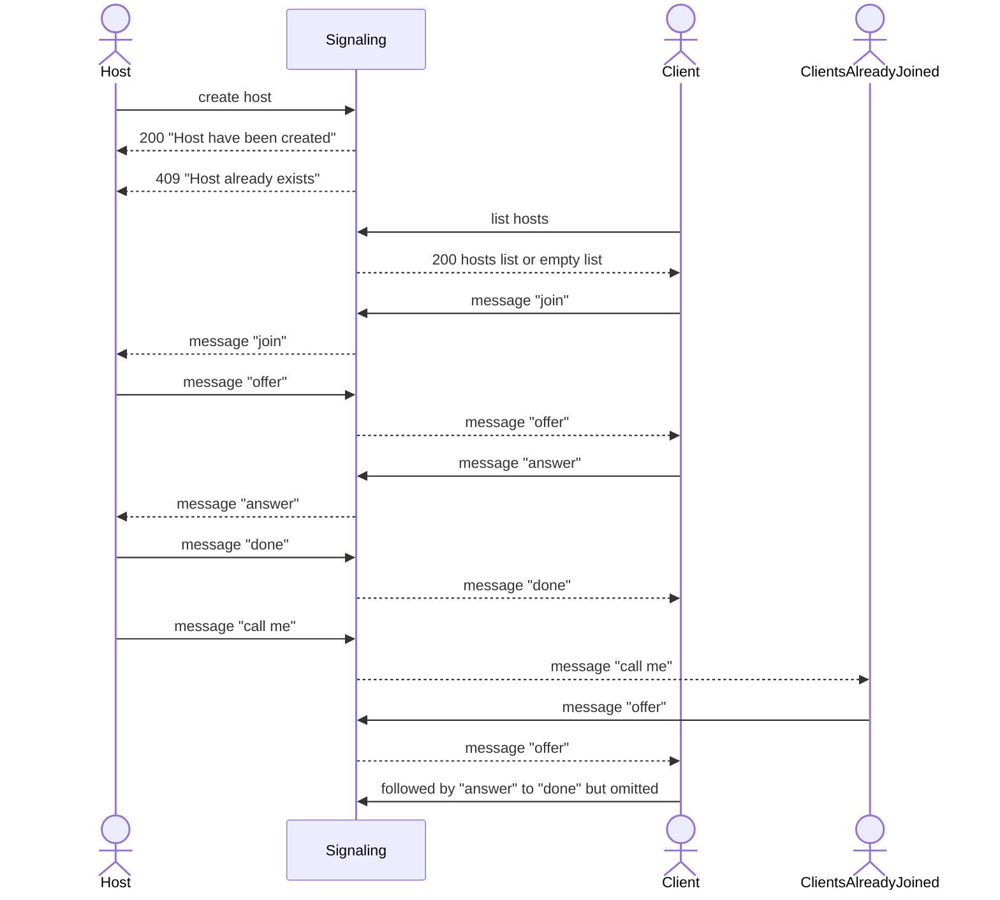

---
sidebar_position: 5
---

# P2P using WebRTC

## What for?

P2P(Peer to Peer) is a means of communication with the lowest possible cost.

This module provides the base features to facilitate the creation of P2P using WebRTC.

## Specification

- You can create host/client P2P.
- You can add processing to trigger P2P state.
- You can add application-specific processing to Native(C#) P2P.
- You can add application-specific processing to WebGL(JavaScript) P2P

## Architecture

This module provides P2P for Native(C#) or WebGL(JavaScript).
PeerClientProvider and PeerClient hide the implementation of the P2P connection, and the application only needs to add application-specific processing such as data channels and media streams to implement P2P.

### Unity



### JavaScript



In P2P, the application and the signaling server cooperate to establish connections between peers.
This module provides features to establish peer-to-peer connections, assuming the following processing flow.
When one user becomes a host and another user joins the host, a P2P connection is established with the host and the users already in the host.



## Installation

### Package

#### Unity
```text
https://github.com/extreal-dev/Extreal.Integration.P2P.WebRTC.git
```

#### npm
```text
@extreal-dev/extreal.integration.p2p.webrtc
```

### Dependencies

P2P.WebRTC uses the following packages.

#### Unity

- [Extreal.Core.Logging](../core/logging.md)
- [Extreal.Core.Common](../core/common.md)
- [Extreal.Integration.Web.Common](../integration/web.common.md)
- [Collections](https://docs.unity3d.com/Packages/com.unity.collections@1.2/manual/index.html)
- [WebRTC](https://docs.unity3d.com/Packages/com.unity.webrtc@3.0/manual/index.html)
- [UniTask](https://github.com/Cysharp/UniTask)
- [UniRx](https://github.com/neuecc/UniRx)
- [System.Text.Json](https://learn.microsoft.com/ja-jp/dotnet/api/system.text.json)
- [SocketIOClient](https://github.com/doghappy/socket.io-client-csharp)

#### npm

- [@extreal-dev/extreal.integration.web.common](https://www.npmjs.com/package/@extreal-dev/extreal.integration.web.common)
- [socket.io-client](https://www.npmjs.com/package/socket.io-client)

### Settings

#### Signaling server

Signaling server is provided by [Docker Compose](https://docs.docker.com/compose/).
Please refer to [README](https://github.com/extreal-dev/Extreal.Integration.P2P.WebRTC/tree/main/SignalingServer~) to prepare your signaling server.

#### Application

Create a PeerClient using PeerClientProvider.
Specify the URL of the signaling server when creating the PeerClient.

```csharp
public class ClientControlScope : LifetimeScope
{
    protected override void Configure(IContainerBuilder builder)
    {
        var peerConfig = new PeerConfig("http://127.0.0.1:3010");
        var peerClient = PeerClientProvider.Provide(peerConfig);
        builder.RegisterComponent(peerClient);
    }
}
```

## Usage

### Create host/client P2P

This module provides the following features to establish a P2P connection

- Create a host by specifying a name.
    - The created user becomes a host.
- Retrieve a list of hosts and join a host by specifying the host.
    - P2P connection to the host and also P2P connection to other clients joining the host.

Host creation by specifying a name is performed by PeerClient's StartHostAsync.

```csharp
await peerClient.StartHostAsync("host name");
```

The list of hosts is obtained by ListHostsAsync of PeerClient.
A list of Host classes with Id and Name is returned.
The Host class Id obtained here is used to join a host.

```csharp
var hosts = await peerClient.ListHostsAsync();
```

Joining the host is achieved by StartClientAsync of PeerClient.

```csharp
await peerClient.StartClientAsync(hostId);
```

Closing a host or leaving a host calls PeerClient's Stop, which stops the P2P connection.

```csharp
peerClient.Stop();
```

### Add processing to trigger P2P state

PeerClient has the following event notifications

- OnStarted
    - Timing: Immediately after the host or client starts
        - Host
            - Immediately after the host is created
        - Client
            - Immediately after all of the following conditions are met
                - Receives "done" from the host
                - IceConnectionState becomes Connected or Completed
    - Type: IObservable
    - Parameters: None
- OnConnectFailed
    - Timing: Immediately after the host or client has failed to connect to the signaling server
    - Type: IObservable
    - Parameters: Reason for connection failure
- OnDisconnected
    - Timing: Immediately after a host or client connected to the signaling server is disconnected
    - Type: IObservable
    - Parameters: Reason for disconnection

### Add application-specific processing to Native(C#) P2P

PeerClient has hooks that can add processing at the start and end of a P2P connection.
PeerClient's AddPcCreateHook method is the start hook and AddPcCloseHook method is the end hook.

These hooks are used to manipulate data channels and media streams to add application-specific features to P2P.

An example implementation for creating a data channel is shown below.

```csharp
#if !UNITY_WEBGL || UNITY_EDITOR
using System.Collections.Generic;
using System.Linq;
using System.Text;
using Extreal.Core.Logging;
using Unity.WebRTC;

namespace Extreal.Integration.P2P.WebRTC.MVS.ClientControl
{
    public class NativeDataChannelClient : DataChannelClient
    {
        private static readonly ELogger Logger = LoggingManager.GetLogger(nameof(NativeDataChannelClient));

        private static readonly string Label = "sample";

        private readonly Dictionary<string, RTCDataChannel> dcDict;

        public NativeDataChannelClient(NativePeerClient peerClient)
        {
            dcDict = new Dictionary<string, RTCDataChannel>();
            peerClient.AddPcCreateHook(CreatePc);
            peerClient.AddPcCloseHook(ClosePc);
        }

        private void CreatePc(string id, bool isOffer, RTCPeerConnection pc)
        {
            if (dcDict.ContainsKey(id))
            {
                return;
            }

            if (isOffer)
            {
                var dc = pc.CreateDataChannel(Label);
                HandleDc(id, dc);
            }
            else
            {
                pc.OnDataChannel += (dc) => HandleDc(id, dc);
            }
        }

        private void HandleDc(string id, RTCDataChannel dc)
        {
            if (dc.Label != Label)
            {
                return;
            }

            if (Logger.IsDebug())
            {
                Logger.LogDebug($"New DataChannel: id={id} label={dc.Label}");
            }

            dcDict.Add(id, dc);
            dc.OnMessage = message => Logger.LogDebug(Encoding.UTF8.GetString(message));
        }

        private void ClosePc(string id)
        {
            if (!dcDict.TryGetValue(id, out var dc))
            {
                return;
            }
            dc.Close();
            dcDict.Remove(id);
        }

        public override void Clear()
        {
            dcDict.Keys.ToList().ForEach(ClosePc);
            dcDict.Clear();
        }
    }
}
#endif
```

### Add application-specific processing to WebGL(JavaScript) P2P

Creating P2P in WebGL(JavaScript) is a bit more involved than in Native(C#) because it requires the coordination of C# and JavaScript.

The mechanism is the same as Native(C#), using hooks to add application-specific processing to P2P.

An example implementation for creating a data channel is shown below.
Get a PeerClient from a function called PeerClientProvider and add hooks using addPcCreateHook and addPcCloseHook.
How to get the PeerClientProvider function is described below.

```typescript
import { PeerClientProvider } from "@extreal-dev/extreal.integration.p2p.webrtc";

class DataChannelClient {
    private readonly label: string = "sample";
    private readonly isDebug: boolean;
    private readonly dcMap: Map<string, RTCDataChannel>;
    private readonly getPeerClient: PeerClientProvider;

    constructor(getPeerClient: PeerClientProvider) {
        this.isDebug = true;
        this.dcMap = new Map();
        this.getPeerClient = getPeerClient;
        this.getPeerClient().addPcCreateHook(this.createPc);
        this.getPeerClient().addPcCloseHook(this.closePc);
    }

    private createPc = (id: string, isOffer: boolean, pc: RTCPeerConnection) => {
        if (this.dcMap.has(id)) {
            return;
        }

        if (isOffer) {
            const dc = pc.createDataChannel(this.label);
            this.handleDc(id, dc);
        } else {
            pc.addEventListener("datachannel", (event) => this.handleDc(id, event.channel));
        }
    };

    private handleDc = (id: string, dc: RTCDataChannel) => {
        if (dc.label !== this.label) {
            return;
        }

        if (this.isDebug) {
            console.log(`New DataChannel: id=${id} label=${dc.label}`);
        }

        this.dcMap.set(id, dc);
    };

    private closePc = (id: string) => {
        const dc = this.dcMap.get(id);
        if (!dc) {
            return;
        }
        dc.close();
        this.dcMap.delete(id);
    };

    public clear = () => {
        [...this.dcMap.keys()].forEach(this.closePc);
        this.dcMap.clear();
    };
}

export { DataChannelClient };
```

:::info
For a development environment using TypeScript, please refer to [sample](https://github.com/extreal-dev/Extreal.Integration.P2P.WebRTC/tree/main/Samples~/MVS/WebGLScripts) in this module.
:::

PeerClientProvider function is provided by PeerAdapter.
PeerAdapter holds PeerClient internally and defines the PeerClient integration between C# and JavaScript.

To perform P2P with WebGL, first create a PeerAdapter and call its adapt function.
Then, use the PeerAdapter's getPeerClient function to implement application-specific processing like the DataChannelClient described earlier.

The timing of the call is important for application-specific processing.
Be careful not to initialize the processing added by the application (in this case, DataChannelClient) before PeerClient.

Use [Web.Common](web.common.md) to control the call timing from C#.
In this case, we use the addAction function.

```typescript
import { addAction } from "@extreal-dev/extreal.integration.web.common";
import { PeerAdapter } from "@extreal-dev/extreal.integration.p2p.webrtc";
import { DataChannelClient } from "./DataChannelClient";

const peerAdapter = new PeerAdapter();
peerAdapter.adapt();

let dataChannelClient: DataChannelClient;
addAction("start", () => dataChannelClient = new DataChannelClient(peerAdapter.getPeerClient));
addAction("clear", () => dataChannelClient.clear);
```

Create a caller in C#.
Use WebGLHelper in [Web.Common](web.common.md).

```csharp
using Extreal.Integration.Web.Common;

namespace Extreal.Integration.P2P.WebRTC.MVS.ClientControl
{
    public class WebGLDataChannelClient : DataChannelClient
    {
        public WebGLDataChannelClient() => WebGLHelper.CallAction("start");

        public override void Clear() => WebGLHelper.CallAction("clear");
    }
}
```
