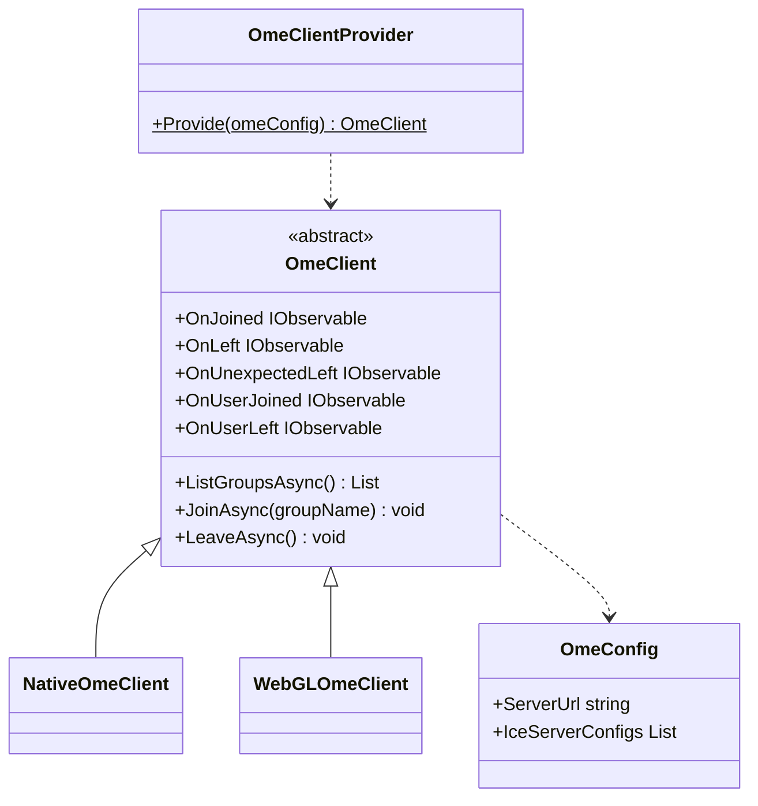
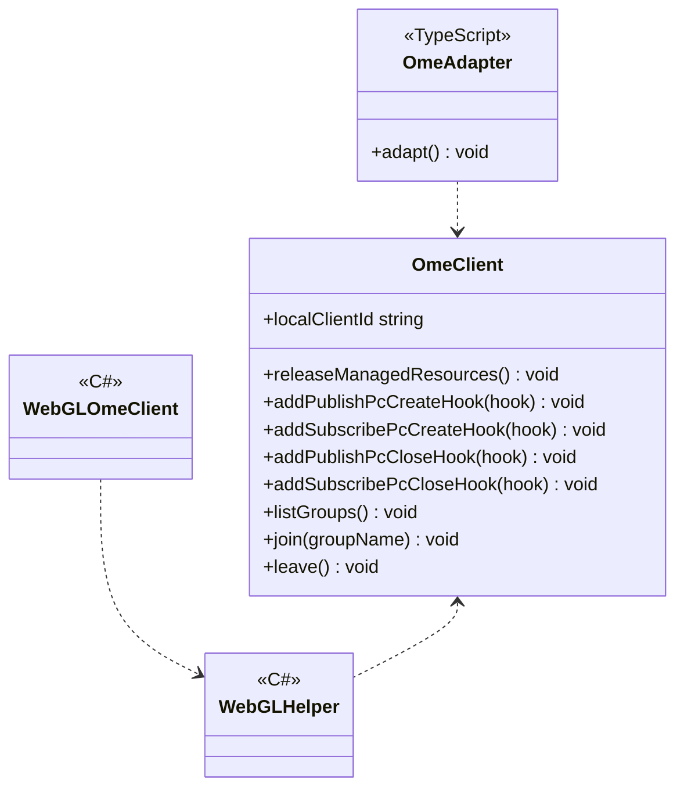
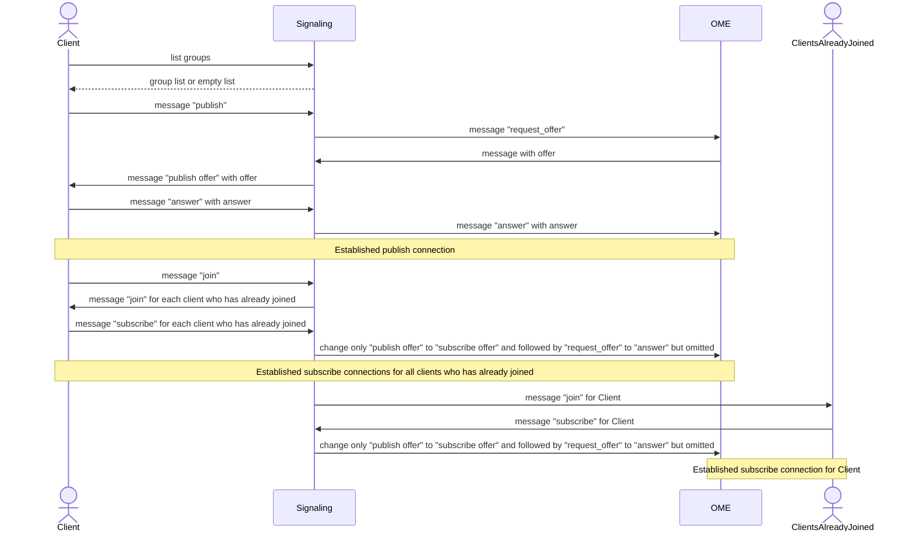

# SFU using OME

## What for?

SFU (Selective Forwarding Unit) is a means of large-scale communication in virtual spaces, etc., with the lowest possible cost.

Although it is relatively easy to implement SFU by using [OME (OvenMediaEngine)](https://airensoft.gitbook.io/ovenmediaengine/), the SFU connection establishment is a similar processing, so it is provided as a common feature.
By using this common feature, an application-specific SFU can be realized by simply adding media stream processing.

This module provides base SFU features for Native (C#) and WebGL (JavaScript).

## Specification

- SFU connections can be established.
- You can add processing triggered by SFU status.
- You can add application-specific processing to Native (C#) SFU.
- You can add application-specific processing to WebGL (JavaScript) SFU.

## Architecture

### Unity



### JavaScript



In SFU with OME, the application, signaling server, and OME server cooperate to establish SFU connections.
This module provides features to establish a SFU connection, assuming the following processing flow.
The publish connection and subscribe connection are connected through separate P2P communication using WebRTC, respectively.



## Installation

### Package

#### Unity
```text
https://github.com/extreal-dev/Extreal.Integration.SFU.OME.git
```

#### npm
```text
@extreal-dev/extreal.integration.sfu.ome
```

### Dependencies

This module uses the following packages.

#### Unity

- [Extreal.Core.Logging](../core/logging.md)
- [Extreal.Core.Common](../core/common.md)
- [Extreal.Integration.Web.Common](../integration/web.common.md)
- [WebRTC](https://docs.unity3d.com/Packages/com.unity.webrtc@3.0/manual/index.html)
- [UniTask](https://github.com/Cysharp/UniTask)
- [UniRx](https://github.com/neuecc/UniRx)
- [NativeWebSocket](https://github.com/endel/NativeWebSocket)

#### npm

- [@extreal-dev/extreal.integration.web.common](https://www.npmjs.com/package/@extreal-dev/extreal.integration.web.common)

### Settings

#### OME server

OME server is provided by [Docker Compose](https://docs.docker.com/compose/).
Please refer to [README](https://github.com/extreal-dev/Extreal.Integration.SFU.OME/tree/main/OMEServer~) to prepare the OME server.

#### Signaling server

Signaling server is provided by [Docker Compose](https://docs.docker.com/compose/).
Please refer to [README](https://github.com/extreal-dev/Extreal.Integration.SFU.OME/tree/main/SignalingServer~) to prepare your signaling server.

#### Application

Create OmeClient using OmeClientProvider.
Specify the URL of the signaling server when creating OmeClient.

```csharp
public class ClientControlScope : LifetimeScope
{
    protected override void Configure(IContainerBuilder builder)
    {
        var omeConfig = new OmeConfig("http://localhost:3040");
        var omeClient = OmeClientProvider.Provide(omeConfig);
        builder.RegisterComponent(omeClient);
    }
}
```

If you want to use it with WebGL, initialize it further with JavaScript.
Create OmeAdapter and call adapt function.

```typescript
import { OmeAdapter } from "@extreal-dev/extreal.integration.sfu.ome";

const omeAdapter = new OmeAdapter();
omeAdapter.adapt();
```

## Usage

- SFU connections can be established.
- You can add processing triggered by SFU status.
- You can add application-specific processing to Native (C#) SFU.
- You can add application-specific processing to WebGL (JavaScript) SFU.

### Establish SFU connection {#sfu-ome-establish-connection}

This module provides the ability to establish SFU connections.
These features are provided by OmeClient.

First, join the group by specifying a name.
If a group with the same name does not yet exist, a new group is created, and if it exists, the user joins that group.

```csharp
await omeClient.JoinAsync("group name");
```

Use the LeaveAsync method to leave the group.

```csharp
await omeClient.LeaveAsync();
```

Use the ListGroupsAsync method to obtain a list of currently existing groups.

```csharp
var groups = await omeClient.ListGroupsAsync();
```

### Add processing triggered by SFU status

OmeClient has the following event notifications

- OnJoined
  - Timing: Immediately after joining a group
  - Type: IObservable
  - Parameters: User's own client ID
- OnLeft
  - Timing: Immediately after leaving the group
  - Type: IObservable
  - Parameters: None
- OnUnexpectedLeft
  - Timing: Immediately after the connection with the signaling server is disconnected
  - Type: IObservable
  - Parameters: Reason for disconnection
- OnUserJoined
  - Timing: Immediately after connecting with another user
    - Connecting users receive events from each other. Therefore, a newly connecting user will receive events for all users already connected.
  - Type: IObservable
  - Parameters: Client ID of the connected user
- OnUserLeft
  - Timing: Immediately after disconnecting from another user
  - Type: IObservable
  - Parameters: Client ID of the disconnected user

### Add application-specific processing to Native (C#) SFU

:::caution
Processing continues even if errors occur during Create/Close of PeerConnection.
:::

OmeClient has hooks that can add processing at the start and end of publish and subscribe connections.

```csharp
omeClient.AddPublishPcCreateHook((id, rtcPeerConnection) =>
{
    // do something
});

omeClient.AddSubscribePcCreateHook((id, rtcPeerConnection) =>
{
    // do something
});

omeClient.AddPublishPcCloseHook((id) =>
{
    // do something
});

omeClient.AddSubscribePcCloseHook((id) =>
{
    // do something
});
```

These hooks are used to manipulate media streams and add application-specific features to the SFU.
An example implementation for adding an audio stream is as follows.

```csharp
using System.Collections.Generic;
using System.Linq;
using Extreal.Core.Logging;
using Unity.WebRTC;
using UnityEngine;

namespace Extreal.Integration.SFU.OME.MVS.ClientControl
{
    public class NativeAudioStreamClient : AudioStreamClient
    {
        private static readonly ELogger Logger = LoggingManager.GetLogger(nameof(NativeAudioStreamClient));

        private (AudioSource inAudio, AudioStreamTrack inTrack, MediaStream inStream) inResource;
        private readonly Dictionary<string, (AudioSource outAudio, MediaStream outStream)> outResources = new Dictionary<string, (AudioSource, MediaStream)>();

        private readonly Transform audioSourceContainer;

        public NativeAudioStreamClient(NativeOmeClient omeClient)
        {
            audioSourceContainer = new GameObject(nameof(audioSourceContainer)).transform;
            Object.DontDestroyOnLoad(audioSourceContainer);

            omeClient.AddPublishPcCreateHook(CreatePublishPc);
            omeClient.AddSubscribePcCreateHook(CreateSubscribePc);
            omeClient.AddPublishPcCloseHook(ClosePublishPc);
            omeClient.AddSubscribePcCloseHook(CloseSubscribePc);
        }

        private void CreatePublishPc(string clientId, RTCPeerConnection pc)
        {
            inResource.inAudio = new GameObject("InAudio").AddComponent<AudioSource>();
            inResource.inAudio.transform.SetParent(audioSourceContainer);

            inResource.inTrack = new AudioStreamTrack(inResource.inAudio)
            {
                Loopback = false
            };
            inResource.inStream = new MediaStream();
            pc.AddTrack(inResource.inTrack, inResource.inStream);
        }

        private void CreateSubscribePc(string clientId, RTCPeerConnection pc) =>
            pc.OnTrack = (RTCTrackEvent e) =>
                {
                    if (Logger.IsDebug())
                    {
                        Logger.LogDebug($"OnTrack: Kind={e.Track.Kind}");
                    }
                };

        private void ClosePublishPc(string clientId)
        {
            if (inResource.inAudio != null)
            {
                inResource.inAudio.Stop();
                Object.Destroy(inResource.inAudio.gameObject);
            }
            if (inResource.inTrack != null)
            {
                inResource.inTrack.Dispose();
            }
            if (inResource.inStream != null)
            {
                inResource.inStream.GetTracks().ToList().ForEach(track => track.Stop());
                inResource.inStream.Dispose();
            }
            inResource = (default, default, default);
        }

        private void CloseSubscribePc(string clientId)
        {
        }

        protected override void DoReleaseManagedResources()
        {
            if (audioSourceContainer != null && audioSourceContainer.gameObject != null)
            {
                Object.Destroy(audioSourceContainer.gameObject);
            }
        }
    }
}
```

### Add application-specific processing to WebGL (JavaScript) SFU

:::caution
Processing continues even if errors occur during Create/Close of PeerConnection.
:::

WebGL (JavaScript) is a bit more extensive than Native (C#) because it requires C# and JavaScript to work together.
The mechanism is the same as Native (C#), using hooks to add application-specific processing to P2P.

An example implementation of adding an audio stream is shown below.
The major difference is that OmeClient is obtained from OmeClientProvider function.

```typescript
import { OmeClientProvider } from "@extreal-dev/Extreal.Integration.SFU.OME";

class InResource {
    public inStream: MediaStream | undefined;
    public inTrack: MediaStreamTrack | undefined;
}

class AudioStreamClient {
    private readonly label: string = "sample";
    private readonly isDebug: boolean;
    private readonly getOmeClient: OmeClientProvider;

    private inResource: InResource | undefined;

    constructor(getOmeClient: OmeClientProvider) {
        this.isDebug = true;
        this.getOmeClient = getOmeClient;
        this.getOmeClient().addPublishPcCreateHook(this.createPublishPc);
        this.getOmeClient().addSubscribePcCreateHook(this.createSubscribePc);
        this.getOmeClient().addPublishPcCloseHook(this.closePublishPc);
        this.getOmeClient().addSubscribePcCloseHook(this.closeSubscribePc);
    }

    private createPublishPc = (clientId: string, pc: RTCPeerConnection) => {
        this.inResource = new InResource();

        const audioContext = new AudioContext();
        const gainNode = audioContext.createGain();
        gainNode.gain.setValueAtTime(0, audioContext.currentTime);

        const destination = audioContext.createMediaStreamDestination();
        gainNode.connect(destination);

        const inStream = destination.stream;
        const inTrack = inStream.getAudioTracks()[0];
        this.inResource.inStream = inStream;
        this.inResource.inTrack = inTrack;

        pc.addTrack(this.inResource.inTrack, this.inResource.inStream);
    };

    private createSubscribePc = (clientId: string, pc: RTCPeerConnection) => {
        pc.addEventListener("track", (event) => {
            if (this.isDebug) {
                console.log(`OnTrack: Kind=${event.track.kind}`);
            }
        });
    };

    private closePublishPc = (clientId: string) => {
        this.inResource = undefined;
    };

    private closeSubscribePc = (clientId: string) => {};
}

export { AudioStreamClient };
```

OmeClientProvider is provided by OmeAdapter, which appeared in [Settings](#settings).
OmeAdapter holds OmeClient internally and defines the interaction between C# and JavaScript.

To do SFU with WebGL, first create OmeAdapter and call adapt function.
Then, use OmeAdapter's getOmeClient function to add application-specific processing like the DataChannelClient described earlier.

The timing of calling application-specific processing is important here.
Be careful not to initialize the processing added by the application (in this case, DataChannelClient) before C#'s OmeClient.
C#'s OmeClient is initialized at the timing when the Provide method of OmeClientProvider is called.

Use [Web.Common](./web.common.md) to control the timing of the call from C#.

```typescript
import { addAction } from "@extreal-dev/extreal.integration.web.common";
import { OmeAdapter } from "@extreal-dev/Extreal.Integration.SFU.OME";
import { AudioStreamClient } from "./AudioStreamClient";
import { DummyClient } from "./DummyClient";


const omeAdapter = new OmeAdapter();
omeAdapter.adapt();

let audioStreamClient: AudioStreamClient;
addAction("start", () => audioStreamClient = new AudioStreamClient(omeAdapter.getOmeClient));
addAction("dummyhook", () => DummyClient.dummyHook(omeAdapter.getOmeClient));
```

Create a C# caller.
Use WebGLHelper in [Web.Common](./web.common.md).

```csharp
using Extreal.Integration.Web.Common;

namespace Extreal.Integration.SFU.OME.MVS.ClientControl
{
    public class WebGLAudioStreamClient : AudioStreamClient
    {
        public WebGLAudioStreamClient() => WebGLHelper.CallAction("start");
    }
}
```
