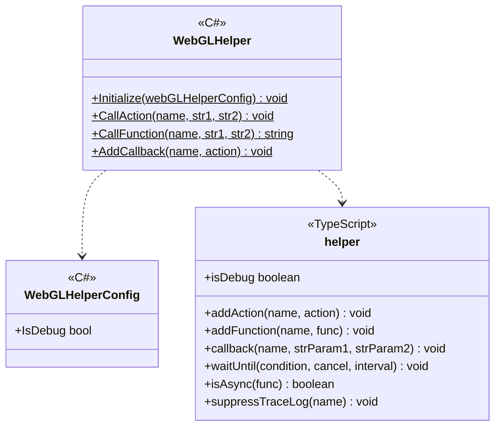

---
sidebar_position: 4
---

# Common for Web

## What for?

Unity allows users to create browser-oriented applications using the WebGL platform.
Browser-oriented applications require calling processing and passing data between Unity(C#) and the browser(JavaScript).

This module hides the slightly more complex mechanism of C# and JavaScript integration provided by Unity and provides a WebGL helper for easy C# and JavaScript interaction.

## Specification

- You can call JavaScript from C#.
- You can do callbacks from JavaScript to C#.

## Architecture



## Installation

### Package

#### Unity
```text
https://github.com/extreal-dev/Extreal.Integration.Web.Common.git
```

#### npm
```text
@extreal-dev/extreal.integration.web.common
```

### Dependencies

This module uses the following packages.

#### Unity
- [System.Text.Json](https://learn.microsoft.com/ja-jp/dotnet/api/system.text.json)

#### npm
- There are no dependencies.

### Settings {#settings}

The WebGL helper needs to be initialized.
Please initialize the WebGL helper when you start the application.

```csharp
WebGLHelper.Initialize();
```

The browser can log the status of JavaScript calls.
The default is to not output logs, so if you want to output logs, specify them in WebGLHelperConfig.

```csharp
WebGLHelper.Initialize(new WebGLHelperConfig { IsDebug = true });
```

## Usage

### Call JavaScript from C# {#call-javascript-from-csharp}

C# to JavaScript calls provide only the following signatures.

- Function with no return value
  - Arguments: 2 strings
  - Return value: None
  - Example:
    ```typescript
    const action = (param1: string, param2: string): void => {
        // do something
    }
    ```
- Function with return value
  - Arguments: 2 strings
  - Return value: string
  - Example:
    ```typescript
    const func = (param1: string, param2: string): string => {
        return "do something";
    }
    ```

:::info
Arguments and return value are strings, so use JSON if you want to handle complex data structures.
:::

The C# side calls JavaScript using WebGLHelper's CallAction/CallFunction.
Action corresponds to a function without a return value and Function corresponds to a function with a return value.
The mapping between C# and JavaScript is done by the string target name.

```csharp
public class Sample : DisposableBase
{
    public void DoAction(string param1, string param2)
        => WebGLHelper.CallAction("DoAction", param1, param2);

    public string DoFunction(string param1, string param2)
        => WebGLHelper.CallFunction("DoFunction", param1, param2);
}
```

The JavaScript side uses addAction/addFunction.

```typescript
import { addAction, addFunction } from "@extreal-dev/extreal.integration.web.common";

addAction("DoAction", (str1, str2) => {
    // do something
});

addFunction("DoFunction", (str1, str2) => {
    return "do something";
});
```

### Callback from JavaScript to C# {#callback-from-javascript-to-csharp}

Only the following signatures are provided for JavaScript to C# callback.

- Action<string, string>

:::info
Arguments and return value are strings, so use JSON if you want to handle complex data structures.
:::

The JavaScript side uses callback.
The mapping between JavaScript and C# is done by the string target name.

```typescript
import { callback } from "@extreal-dev/extreal.integration.web.common";

callback("HandleOnCallback", "param1", "param2");
```

The C# side uses WebGLHelper's AddCallback.
In this example implementation, the callback is received and event notification is sent.

```csharp
public class Sample : DisposableBase
{
    public IObservable<string> OnCallback => onCallback;
    private readonly Subject<string> onCallback = new Subject<string>();

    private static Sample instance;
    public Sample()
    {
        instance = this;
        WebGLHelper.AddCallback(nameof(HandleOnCallback), HandleOnCallback);
    }

    [MonoPInvokeCallback(typeof(Action<string, string>))]
    private static void HandleOnCallback(string str1, string str2)
        => instance.onCallback.OnNext($"received {str1} {str2} in callback");

    protected override void ReleaseManagedResources() => onCallback.Dispose();
}
```

### Suppress trace logs of JavaScript call

If you specify to output logs when [initializing the WebGL helper](#settings), it will print a log every time [JavaScript is called from C#](#call-javascript-from-csharp) and every time [JavaScript calls back to C#](#callback-from-javascript-to-csharp).

By using suppressTraceLog, you can suppress log output for specific function calls or callbacks.
If the argument string matches the target name specified in addAction/addFunction/callback, log output for that function call or callback will be suppressed.

```typescript
import { suppressTraceLog } from "@extreal-dev/extreal.integration.web.common";

suppressTraceLog("ActionOrFunctionOrCallbackNameToSuppressLog");
```
