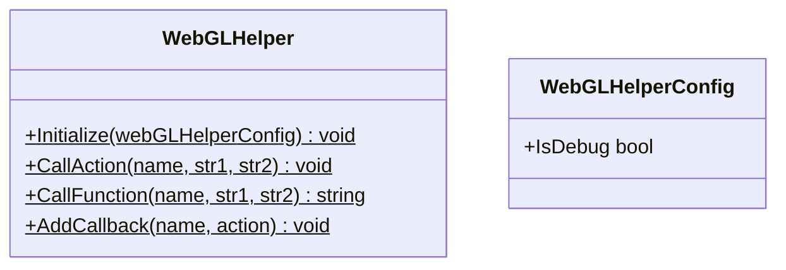

---
sidebar_position: 4
---

# Common for Web

## What for?

Unity allows users to create browser-oriented applications using the WebGL platform.
Browser-oriented applications require calling processing and passing data between Unity (C#) and the browser (JavaScript).

This module makes it easier to use the C# and JavaScript integration mechanism provided by Unity.

## Specification

- You can call JavaScript from C#.
- You can do callbacks from JavaScript to C#.

## Architecture



## Installation

### Package

#### Unity
```text
https://github.com/extreal-dev/Extreal.Integration.Web.Common.git
```

#### npm
```text
@extreal-dev/extreal.integration.web.common
```

### Dependencies

The Web.Common uses the following packages.

#### Unity
- [System.Text.Json](https://learn.microsoft.com/ja-jp/dotnet/api/system.text.json)

#### npm
There are no dependencies.

### Settings

You can set whether or not debug logs are output on the browser side.
The default is no debug log output.

If you wish to output debug logs, use WebGLHelper's Initialize method.

```csharp
WebGLHelper.Initialize(new WebGLHelperConfig { IsDebug = true });
```

## Usage

### Call JavaScript from C#

C# to JavaScript calls provide only the following signatures.

- Function with no return value
  - Arguments: 2 strings
  - Return value: None
- Function with return value
  - Arguments: 2 strings
  - Return value: string

:::info
Arguments and return value are strings, so use JSON if you want to handle complex data structures.
:::

The C# side uses WebGLHelper's CallAction and CallFunction methods.

```csharp
public class Sample : DisposableBase
{
    public void DoAction(string param1, string param2)
        => WebGLHelper.CallAction(nameof(DoAction), param1, param2);

    public string DoFunction(string param1, string param2)
        => WebGLHelper.CallFunction(nameof(DoFunction), param1, param2);
}
```

On the JavaScript side, use the addAction and addFunction functions.

```typescript
import { addAction, addFunction } from "@extreal-dev/extreal.integration.web.common";

addAction("DoAction", (str1, str2) => {
    // do something
});

addFunction("DoFunction", (str1, str2) => {
    return "do something";
});
```

### Callback from JavaScript to C#

Only the following signatures are provided for JavaScript to C# callback.

- Action<string, string>

:::info
Arguments and return value are strings, so use JSON if you want to handle complex data structures.
:::

The JavaScript side uses the callback function.

```typescript
import { callback } from "@extreal-dev/extreal.integration.web.common";

callback("HandleOnCallback", "param1", "param2");
```

On the C# side, use the AddCallback method of WebGLHelper.
In this example implementation, the callback is received and event notification is sent.

```csharp
public class Sample : DisposableBase
{
    public IObservable<string> OnCallback => onCallback;
    private readonly Subject<string> onCallback = new Subject<string>();

    private static Sample instance;
    public Sample()
    {
        instance = this;
        WebGLHelper.AddCallback(nameof(HandleOnCallback), HandleOnCallback);
    }

    [MonoPInvokeCallback(typeof(Action<string, string>))]
    private static void HandleOnCallback(string str1, string str2)
        => instance.onCallback.OnNext($"received {str1} {str2} in callback");

    protected override void ReleaseManagedResources() => onCallback.Dispose();
}
```
