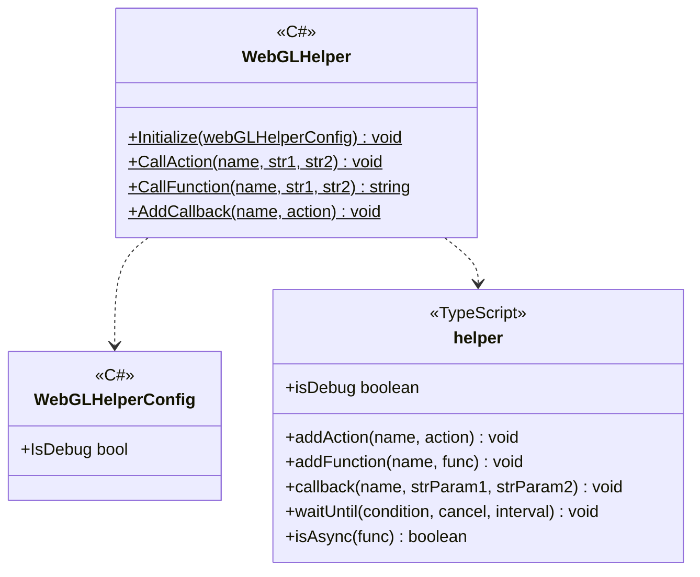
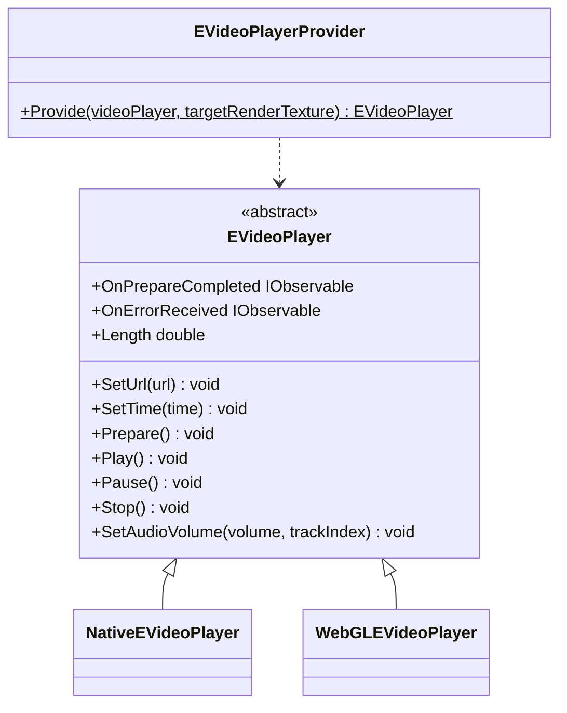
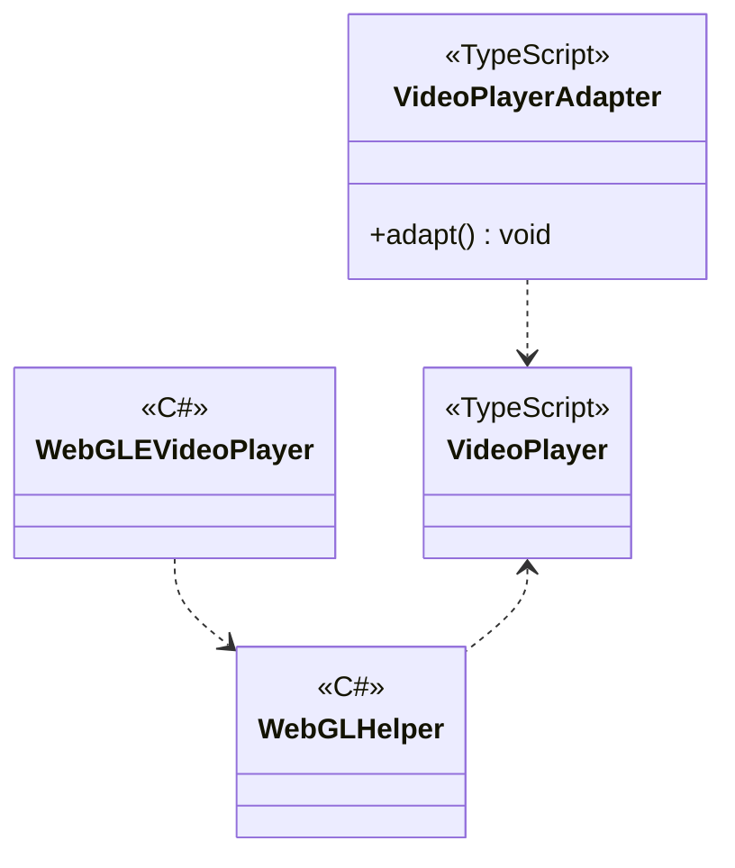

---
sidebar_position: 4
---

# Common for Web

## What for?

Unity allows users to create browser-oriented applications using the WebGL platform.
Browser-oriented applications require calling processing and passing data between Unity(C#) and the browser(JavaScript).

This module hides the slightly more complex mechanism of C# and JavaScript integration provided by Unity and provides a WebGL helper for easy C# and JavaScript interaction.

## Specification

- You can call JavaScript from C#.
- You can do callbacks from JavaScript to C#.
- You can play videos according to the platform.

## Architecture



### VideoPlayer

#### Unity



#### JavaScript



## Installation

### Package

#### Unity
```text
https://github.com/extreal-dev/Extreal.Integration.Web.Common.git
```

#### npm
```text
@extreal-dev/extreal.integration.web.common
```

### Dependencies

This module uses the following packages.

#### Unity
- [Extreal.Core.Logging](../core/logging.md)
- [Extreal.Core.Common](../core/common.md)
- [UniTask](https://github.com/Cysharp/UniTask)
- [UniRx](https://github.com/neuecc/UniRx)
- [System.Text.Json](https://learn.microsoft.com/ja-jp/dotnet/api/system.text.json)

#### npm
- There are no dependencies.

### Settings

The WebGL helper needs to be initialized.
Please initialize the WebGL helper when you start the application.

```csharp
WebGLHelper.Initialize();
```

The browser can log the status of JavaScript calls.
The default is to not output logs, so if you want to output logs, specify them in WebGLHelperConfig.

```csharp
WebGLHelper.Initialize(new WebGLHelperConfig { IsDebug = true });
```

#### VideoPlayer

Create an EVideoPlayer using EVideoPlayerProvider.
If using WebGL, set the RenderTexture you want to use to targetRenderTexture.
For non-WebGL, set the VideoPlayer component you want to use to videoPlayer.

```csharp
var eVideoPlayer = EVideoPlayerProvider.Provide(videoPlayer, renderTexture);
```

:::info
If you set both TargetRenderTexture and VideoPlayer, you can use both WebGL-oriented and non-WebGL features simply by switching platforms.
:::

If you want to use on WebGL, initialize it further in JavaScript.
Create a VideoPlayerAdapter and call the adapt function.

```typescript
import { VideoPlayerAdapter } from "@extreal-dev/extreal.integration.web.common";

const videoPlayerAdapter = new VideoPlayerAdapter();
videoPlayerAdapter.adapt();
```

## Usage

### Call JavaScript from C#

C# to JavaScript calls provide only the following signatures.

- Function with no return value
  - Arguments: 2 strings
  - Return value: None
  - Example:
    ```typescript
    const action = (param1: string, param2: string): void => {
        // do something
    }
    ```
- Function with return value
  - Arguments: 2 strings
  - Return value: string
  - Example:
    ```typescript
    const func = (param1: string, param2: string): string => {
        return "do something";
    }
    ```

:::info
Arguments and return value are strings, so use JSON if you want to handle complex data structures.
:::

The C# side calls JavaScript using WebGLHelper's CallAction/CallFunction.
Action corresponds to a function without a return value and Function corresponds to a function with a return value.
The mapping between C# and JavaScript is done by the string target name.

```csharp
public class Sample : DisposableBase
{
    public void DoAction(string param1, string param2)
        => WebGLHelper.CallAction("DoAction", param1, param2);

    public string DoFunction(string param1, string param2)
        => WebGLHelper.CallFunction("DoFunction", param1, param2);
}
```

The JavaScript side uses addAction/addFunction.

```typescript
import { addAction, addFunction } from "@extreal-dev/extreal.integration.web.common";

addAction("DoAction", (str1, str2) => {
    // do something
});

addFunction("DoFunction", (str1, str2) => {
    return "do something";
});
```

### Callback from JavaScript to C#

Only the following signatures are provided for JavaScript to C# callback.

- Action\<string, string\>

:::info
Arguments and return value are strings, so use JSON if you want to handle complex data structures.
:::

The JavaScript side uses callback.
The mapping between JavaScript and C# is done by the string target name.

```typescript
import { callback } from "@extreal-dev/extreal.integration.web.common";

callback("HandleOnCallback", "param1", "param2");
```

The C# side uses WebGLHelper's AddCallback.
In this example implementation, the callback is received and event notification is sent.

```csharp
public class Sample : DisposableBase
{
    public IObservable<string> OnCallback => onCallback;
    private readonly Subject<string> onCallback = new Subject<string>();

    private static Sample instance;
    public Sample()
    {
        instance = this;
        WebGLHelper.AddCallback(nameof(HandleOnCallback), HandleOnCallback);
    }

    [MonoPInvokeCallback(typeof(Action<string, string>))]
    private static void HandleOnCallback(string str1, string str2)
        => instance.onCallback.OnNext($"received {str1} {str2} in callback");

    protected override void ReleaseManagedResources() => onCallback.Dispose();
}
```

### Play videos according to platform

The ability to delegate video playback on WebGL to JavaScript is provided by EVideoPlayer.

:::info
The same API can be used for video playback on the platforms other than WebGL.
:::

Set the URL where the video you wish to use is located and prepare for video playback.

```csharp
videoPlayer.SetUrl("URL");
videoPlayer.Prepare();
```

The OnPrepareCompleted event fires when the video is ready to play.

```csharp
videoPlayer.OnPrepareCompleted
    .Subscribe(_ =>
    {
        // Handle processing when preparation is completed here.
    })
    .AddTo(disposables);
```

Use the Play/Pause/Stop methods to play/pause/stop video, respectively.

```csharp
videoPlayer.Play();
videoPlayer.Pause();
videoPlayer.Stop();
```

If an error occurs during video preparation or playback, the OnErrorReceived event is fired.

```csharp
videoPlayer.OnErrorReceived
    .Subscribe(appState.Notify)
    .AddTo(disposables);
```

To adjust the volume of the video, use the SetAudioVolume method.
Enter a float value between 0 and 1 for the argument volume.

```csharp
videoPlayer.SetAudioVolume(volume);
```

Use the Length property to obtain the length of the video.
The unit of the return value is seconds.

```csharp
var videoLength = videoPlayer.Length;
```

Use the SetTime method to specify the playback position of the video.
The unit of argument is seconds.

```csharp
videoPlayer.SetTime(time);
```
