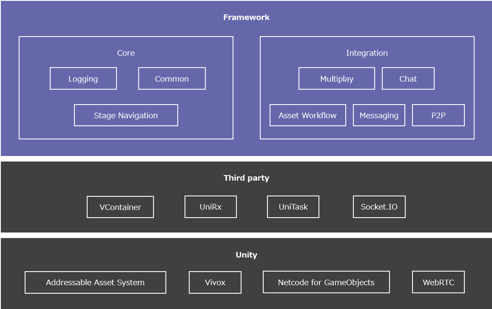
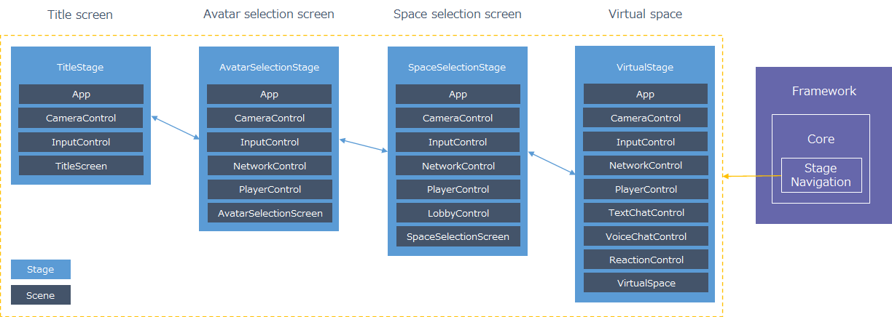
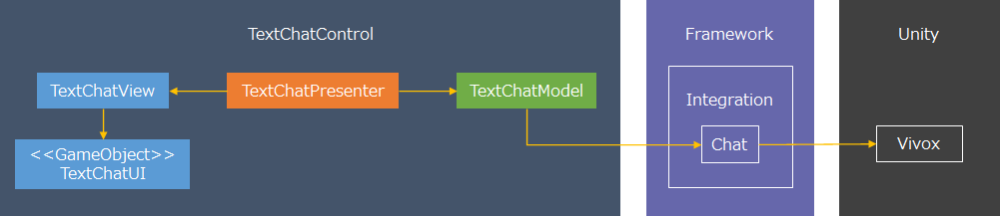

# Introduction

This section describes the grand design of Extreal.
All of Extreal's contents are based on this grand design.

## Contents

Extreal provides the following contents.

- Framework
  - Unity-based XR framework
  - Provided as a Unity package
- Sample Application
  - A sample application using Framework
  - Provided as a Unity project
- Learning
  - Learning materials to learn how to use Framework
  - Included in this guide
- Guide
  - A guide that will guide you through the use of Extreal
  - This document is the guide

## Architecture

This section describes the Framework architecture and the application architecture assumed by Framework.
Framework and Sample Application are created assuming this architecture.

### Framework



Framework leverages Unity and third-party packages to achieve features.
Framework classifies the features into the following categories.

- Core
  - Provides the core features that form the basis of an application
  - Core includes features that are used in any application, such as log output and screen transitions
- Integration
  - Provides features that are integrated into the application according to the requirements of the application
  - Integration includes features that are used according to the requirements of the application, such as chat or multiplayer

Core and Integration are further divided into modules by feature unit.
Framework is a collection of modules.
Framework provides the following features.

- Core
  - [Logging](./core/logging.md)
  - [Stage Navigation](./core/stage-navigation.md)
  - [Common](./core/common.md)
- Integration
  - [Chat using Vivox](./integration/chat.vivox.md)
  - [Multiplay using Netcode for GameObjects](./integration/multiplay.ngo.md)
  - [Asset Workflow using Addressables](./integration/asset-workflow.addressables.md)
  - [Common for Web](./integration/web.common.md)
  - [P2P using WebRTC](./integration/p2p.webrtc.md)
  - [Chat using WebRTC](./integration/chat.webrtc.md)

All modules depend on Logging to unify log output.

### Application

Games and XR applications are composed of a screen and a space because they include not only the GUI but also the space to run around in.
In Extreal, these screens and spaces are called stages.
For example, an application that requires users to gather in a virtual space to do something would consist of the following stages: title screen, avatar selection screen, space selection screen, virtual space, and so on.
There are some features that are common to multiple stages, such as input control, or that are used only in a specific stage, such as voice chat.
If these features can be freely combined to create a stage, reusability of the features will increase and maintenance will be easier.

Unity provides scenes as units for creating screens and spaces.
While a single scene is often used to create a single screen or space, Extreal allows you to freely combine features to create a stage by creating a single feature or screen in a single scene and combining multiple scenes.



Use [Stage Navigation](./core/stage-navigation.md) provided by Framework to create stages combining multiple scenes and to switch between stages.

Features and screens created in scenes are created using the MV(R)P pattern.
For more information on the MV(R)P pattern, please refer to [【Unity】Model-View-(Reactive)Presenterパターンとは何なのか](https://qiita.com/toRisouP/items/5365936fc14c7e7eabf9).


Use third-party [UniRx](https://github.com/neuecc/UniRx) for event notification required for the MV(R)P pattern.
Use third-party [VContainer](https://vcontainer.hadashikick.jp/) for creating each MVP object, establishing reference relationships and controlling the execution of each object's lifecycle events.

For example, the following is an image of the realization of a text chat feature.



Create UI and MVP according to the application requirements and realize text chat using the features provided by Framework from Model.

## License

[Apache License 2.0](https://www.apache.org/licenses/LICENSE-2.0)

Contents provided by Extreal are free of charge.
For external products, services, OSS, etc., please check the license of the provider.

## Backward compatibility

Extreal leverages Unity and third-party packages to achieve its features.
Because there are many elements of Extreal over which we have no control, we cannot promise to maintain backward compatibility.
We will do our best to maintain backward compatibility of Extreal, but there may be cases where backward compatibility cannot be maintained.
If backward compatibility cannot be maintained, [Release](./category/release) will guide you on how to upgrade.

## Versioning

Extreal is versioned for a specific version combination of modules in Framework.
Each module is versioned on an individual module basis.

Extreal versions and module versions use the following versioning.

- &lt;Major version>.&lt;Minor version>.&lt;Patch version>
- Major version
  - Updated when major changes are made, such as architectural changes
- Minor version
  - Updated when features are added, changed, deleted, or defects are fixed
- Patch version
  - Updated when urgent bug fixes are made

Examples of Extreal version and module version are shown below.

```text
--- Initial release ---
Extreal 1.0.0
Extreal.Core.Logging 1.0.0
Extreal.Core.StageNavigation 1.0.0

--- Bug fixed only ---
Extreal 1.0.1
Extreal.Core.Logging 1.0.0
Extreal.Core.StageNavigation 1.0.1 -> bug fixed

--- Added feature ---
Extreal 1.1.0
Extreal.Core.Logging 1.1.0 -> added feature
Extreal.Core.StageNavigation 1.0.1
```

Please refer to [Release](./category/release) for the correspondence between Extreal version and module version.

## Unity version

This section describes how Extreal will follow the Unity version.
Extreal's policy is to use the latest version of Unity from the LTS ([Long Term Support](https://unity3d.com/unity/qa/lts-releases)) stream for development and testing.
The Extreal team will determine when to raise the Unity version by checking the support status of third-party libraries used by Extreal.

## Installation

Framework is provided as a Unity package.
Use Package Manager to install it from the Git URL.

[Installing from a Git URL](https://docs.unity3d.com/2021.3/Documentation/Manual/upm-ui-giturl.html)

Please refer to each feature page for the Git URL.

- [Core](./category/core)
- [Integration](./category/integration)

## Feedback or Contribution

Please send feedback to Issue on GitHub and contributions to Pull Request(PR) on GitHub.

- [GitHub](https://github.com/extreal-dev)

Since the repository for each module of Framework is structured as a Unity package, it must be installed and developed in a Unity project.
For the purpose of unifying the development environment, a repository for developing modules of Framework is provided.
Please use the following repository when developing modules for Framework.
Please refer to README for the development method.

- Modules except AssetWorkflow.Addressables
  - [Extreal.Dev](https://github.com/extreal-dev/Extreal.Dev)
- AssetWorkflow.Addressables module
  - [Extreal.Integration.AssetWorkflow.Addressables.Test](https://github.com/extreal-dev/Extreal.Integration.AssetWorkflow.Addressables.Test)

## About Extreal

The name Extreal was originally named after the phrase "XR to Real (from virtual to real)".

```text
XR to Real　→　XRtoReal　→　XtoReal
```

Furthermore, "Xto" was transformed into the prefix "Ext," which means "to expand" and it became the current name Extreal.

```text
XtoReal →　Extreal
```

We are aiming for such a future with Extreal, where everyone can utilize virtuality to solve real-life problems.
