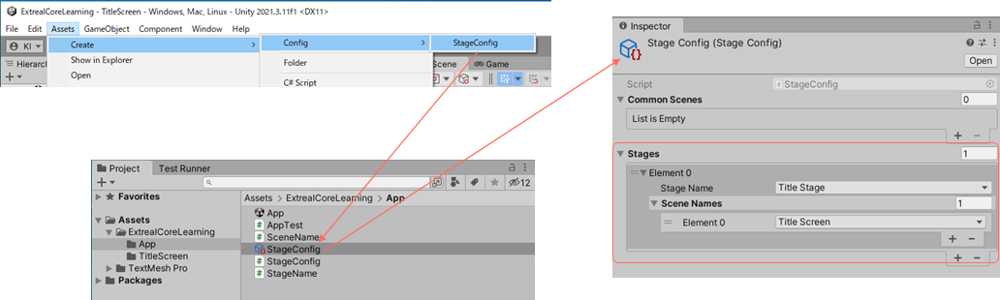
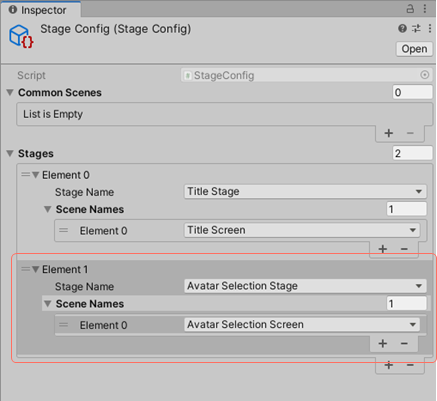
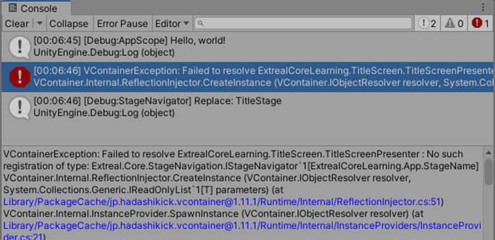

# Core

In this section, you will learn about [Core](../category/core).

- Approximate learning time
  - 60 min
- Unity Version
  - 2022.3.17f1

You will start by creating a project and introducing Core features, as well as VContainer and UniRx, to build the application architecture assumed by Extreal.

## Create project

:::info step
First, let's create a project.
:::

Create a new project from Unity Hub.


- Editor version: `2022.3.17f1`
- Template: `3D`
- Project name: `ExtrealCoreLearning`

:::info step
Once the Unity editor starts, run it to make sure there are no problems.
:::

Let's run SampleScene.
Since nothing is placed in the scene, nothing will happen.
If nothing appears in the Console, it is a successful.

## Create entry point

:::info step
Create a directory for the application and an App scene to serve as the entry point.
:::


- Remove the initial `Assets/Scenes` directory
- Create a directory that will become `Assets/ExtrealCoreLearning/App`
- Create an `App` scene in the `App` directory

## Add Logging

Add [Logging](../core/logging.md) to the application.

:::info step
Add Logging from Package Manager.
:::

Add Logging by specifying a Git URL.
Git URL is obtained from [Package of Logging](../core/logging.md#package).


If `Extreal.Core.Logging` is added to Package Manager, it is successful.
The version depends on the timing of implementation.

:::info step
Allow scripts to reference Logging.
:::

Set Logging to Assembly Definition for the application.


- Create an Assembly Definition named `ExtrealCoreLearning` in the ExtrealCoreLearning directory
- Specify `ExtrealCoreLearning` as the Root Namespace
- Add `Extreal.Core.Logging` to the Assembly Definition References
- Uncheck `Use GUIDs` in Assembly Definition References

:::info step
Add a Logging setting since we want to output Debug-level logs for development.
:::

Since the default logging level for Logging is Info, add Logging Settings to change the logging level.

Create an `AppTest` script in the App scene by referring to [Logging Settings](../core/logging.md#settings).

- Create an AppTest script in the App directory
- Create a GameObject with the AppTest script attached in the App scene

```csharp
using Extreal.Core.Logging;
using UnityEngine;

namespace ExtrealCoreLearning.App
{
    public class AppTest : MonoBehaviour
    {
        private static void InitializeApp()
        {
            const LogLevel logLevel = LogLevel.Debug;
            LoggingManager.Initialize(logLevel: logLevel);
        }

        private void Awake()
        {
            InitializeApp();
        }
    }
}
```

:::info step
Since it is not possible to check the operation of Logging as it is, add processing so that logging is output immediately after initialization of Logging.
:::

```csharp
private static void InitializeApp()
{
    const LogLevel logLevel = LogLevel.Debug;
    LoggingManager.Initialize(logLevel: logLevel);

    // highlight-start
    var logger = LoggingManager.GetLogger(nameof(AppTest));
    if (logger.IsDebug())
    {
        logger.LogDebug("Hello, world!");
    }
    // highlight-end
}
```

Run the App scene.
If the Console outputs `Hello, world!`, it is successful.


## Add Stage Navigation

Add [Stage Navigation](../core/stage-navigation.md) to the application.

:::info step
Stage Navigation depends on [UniTask](https://github.com/Cysharp/UniTask) and [UniRx](https://github.com/neuecc/UniRx), so add UniTask and UniRx first.
:::

UniTask and UniRx are provided by [OpenUPM](https://openupm.com/), so add OpenUPM settings.
Go to `Edit` -> `Project Settings...` -> `Package Manager` and add OpenUPM to Scoped Registries.


- Name:
  ```text
  OpenUPM
  ```
- URL:
  ```text
  https://package.openupm.com
  ```
- Scope(s):
  - UniTask
    ```text
    com.cysharp
    ```
  - UniRx
    ```text
    com.neuecc
    ```

:::info step
Now that UniTask and UniRx have been added, make Stage Navigation available from the script.
:::

Stage Navigation depends on [Common](../core/common.md), so add Common as well.

Operate the Package Manager and Assembly Definition in the same manner as for Logging.
The Git URLs for Common and Stage Navigation are obtained from [Package for Common](../core/common.md#package) and [Package for Stage Navigation](../core/stage-navigation.md#package).
Also set UniTask and UniRx in Assembly Definition.


To test the stage navigation, let's add a title screen and transition to the title screen immediately after launching the app.

:::info step
First, add a title screen.
:::


- Create a `TitleScreen` directory in the same hierarchy as the App directory
- Create a `TitleScreen` scene in it
- Remove the default GameObjects such as the camera from the TitleScreen scene and make the scene empty
- Add a `Canvas` to the scene. In the inspector, make the following settings
  
  - Canvas Scaler
    - UI Scale Mode: `Scale With Screen Size`
- Add an `Image` under the Canvas. Make the following settings in the `Image`'s inspector
  
  - Rect Transform
    - Anchor Presets
      - X: `stretch`
      - Y: `stretch`
    - All from Left to Buttom are `0 (Zero)`
  - Image
    - Color
      - Hexadecimal: `FF6F61`
- Add `Text - TextMeshPro` under `Image`
  - Create a title `Extreal Core Learning`
  - You can decide the size and position freely
  - When the TMP Importer appears, select `Import TMP Essentials`. Only the first time you use TextMeshPro, the TMP Importer will appear. Once imported, close the TMP Importer
- Add `Button - TextMeshPro` under Image
  - Create a button called `Go`
  - You can decide the size and position of this button freely as well

:::info step
Now that the title screen has been added, create the stage settings.
:::

Refer to [Settings for Stage Navigation](../core/stage-navigation.md#settings) to create stage settings.
The three types to be created in the stage settings are placed in the App directory.

```csharp
public enum StageName
{
    TitleStage = 0,
}
public enum SceneName
{
    TitleScreen = 100,
}
```

Once the three types have been created, create a `StageConfig` object.



- Create a `StageConfig` object in the App directory from the Assets menu
- Set the stage of the title screen in the StageConfig object

:::info step
Now that the stage transition is ready, add a processing to make the transition to the title screen immediately after the application is launched.
:::

- Add the SerializeField and Start method to the AppTest script
- Specify the StageConfig object in the inspector

```csharp
using Extreal.Core.Logging;
// highlight-start
using Extreal.Core.StageNavigation;
// highlight-end
using UnityEngine;

namespace ExtrealCoreLearning.App
{
    public class AppTest : MonoBehaviour
    {
        private static void InitializeApp()
        {
            // Omitted due to no changes
        }

        private void Awake()
        {
            // Omitted due to no changes
        }
        
        // highlight-start
        [SerializeField] private StageConfig stageConfig;

        private void Start()
        {
            var stageNavigator = new StageNavigator<StageName, SceneName>(stageConfig);
            stageNavigator.ReplaceAsync(StageName.TitleStage);
        }
        // highlight-end
    }
}
```

:::info step
Let's run the App scene.
:::

Running the App scene in this state will result in the following error.


Add a `TitleScreen` scene to `Scenes In Build` in Build Settings.

:::info step
Let's run the App scene again.
:::

If the title screen appears and the Console shows `[Debug:StageNavigator] Transitions to 'TitleStage'`, it is successful.


## Apply MV(R)P pattern

That is all the Core features that Extreal provides, but we would like to add [VContainer](https://vcontainer.hadashikick.jp/) to get closer to [the application architecture assumed by Extreal](../intro.md#application).

:::info step
Add an avatar selection screen to which the title screen transitions.
:::

The avatar selection screen is only used as a transition destination, so it is created by copying the title screen.


- Create an `AvatarSelectionScreen` directory in the same hierarchy as the App directory
- Create an `AvatarSelectionScreen` scene in it
- Remove the default GameObjects such as the camera in the AvatarSelectionScreen scene and make the scene empty
- Copy the Canvas and EventSystem from the TitleScreen scene and paste them into the AvatarSelectionScreen scene
- Change the title to `Avatar Selection`

:::info step
Then add the stage settings.
:::



- Add `AvatarSelectionStage` to StageName and `AvatarSelectionScreen` to SceneName
- Add `AvatarSelectionStage` in the StageConfig object inspector

Add the `AvatarSelectionScreen` scene to `Scenes In Build` in Build Settings.

The UI and stage settings are ready.

:::info step
Add VContainer to your application.
:::

VContainer is obtained from OpenUPM as well as UniTask and UniRx.

Go to `Edit` -> `Project Settings...` -> `Package Manager` and add the Scope(s) from OpenUPM.


- VContainer:
  ```text
  jp.hadashikick
  ```

:::info step
Then add VContainer to Package Manager and Assembly Definition.
:::


- Select Packages: `My Registries` in Package Manager and install VContainer
- Set VContainer to Assembly Definition of the application

Now you can use VContainer.

### VContainer

Rebuild the AppTest created for confirmation using VContainer.

:::info step
First, create a Presenter script as an entry point.
:::

Create it in the App directory.
When the App scene starts, make the transition to the title screen.

```csharp
using System.Threading;
using Cysharp.Threading.Tasks;
using Extreal.Core.StageNavigation;
using VContainer.Unity;

namespace ExtrealCoreLearning.App
{
    public class AppPresenter : IAsyncStartable
    {
        private StageNavigator<StageName, SceneName> stageNavigator;

        public AppPresenter(StageNavigator<StageName, SceneName> stageNavigator)
        {
            this.stageNavigator = stageNavigator;
        }

        public async UniTask StartAsync(CancellationToken cancellation)
        {
            await stageNavigator.ReplaceAsync(StageName.TitleStage);
        }
    }
}
```

:::info step
Next, create a Scope script as a LifetimeScope for VContainer.
:::

Create it in the App directory.
Override Awake in the Scope script to configure Logging before VContainer processing.

```csharp
using Extreal.Core.Logging;
using Extreal.Core.StageNavigation;
using UnityEngine;
using VContainer;
using VContainer.Unity;

namespace ExtrealCoreLearning.App
{
    public class AppScope : LifetimeScope
    {
        [SerializeField] private StageConfig stageConfig;

        private static void InitializeApp()
        {
            const LogLevel logLevel = LogLevel.Debug;
            LoggingManager.Initialize(logLevel: logLevel);

            var logger = LoggingManager.GetLogger(nameof(AppScope));
            if (logger.IsDebug())
            {
                logger.LogDebug("Hello, world!");
            }
        }

        protected override void Awake()
        {
            InitializeApp();
            base.Awake();
        }

        protected override void Configure(IContainerBuilder builder)
        {
            builder.RegisterComponent(stageConfig).AsImplementedInterfaces();
            builder.Register<StageNavigator<StageName, SceneName>>(Lifetime.Singleton);

            builder.RegisterEntryPoint<AppPresenter>();
        }
    }
}
```

StageConfig, StageNavigator and AppPresenter as entry points are registered.
With this registration, StageConfig is set to StageNavigator and StageNavigator is set to AppPresenter.
In this way, the DI container provided by VContainer is used to build up the object structure so that each object can execute processing.

:::info step
Set the Scope script to the App scene.
:::


- Create a GameObject with the AppScope script attached to the App scene with the name `Scope`.
- Set the StageConfig object in the inspector
- Remove the AppTest script and the GameObject with the AppTest script attached in the App scene as they are no longer needed

Run the App scene.
If the title screen and Console log output appear as before, it is successful.

### UniRx

Implement the Go button on the title screen using UniRx.

:::info step
Create a View script for the title screen.
:::

Create it in the TitleScreen directory.

```csharp
using System;
using UniRx;
using UnityEngine;
using UnityEngine.UI;

namespace ExtrealCoreLearning.TitleScreen
{
    public class TitleScreenView : MonoBehaviour
    {
        [SerializeField] private Button goButton;

        public IObservable<Unit> OnGoButtonClicked
            => goButton.OnClickAsObservable().TakeUntilDestroy(this);
    }
}
```

This defines `OnGoButtonClicked`, which notifies an event when the Go button is pressed using UniRx.

:::info step
Next, create a Presenter script that will transition to the avatar selection screen when the Go button is pressed.
:::

Create it in the TitleScreen directory.

```csharp
using Cysharp.Threading.Tasks;
using Extreal.Core.Common.System;
using Extreal.Core.StageNavigation;
using ExtrealCoreLearning.App;
using UniRx;
using VContainer.Unity;

namespace ExtrealCoreLearning.TitleScreen
{
    public class TitleScreenPresenter : DisposableBase, IInitializable
    {
        private StageNavigator<StageName, SceneName> stageNavigator;

        private TitleScreenView titleScreenView;

        private CompositeDisposable compositeDisposable = new CompositeDisposable();

        public TitleScreenPresenter(StageNavigator<StageName, SceneName> stageNavigator,
            TitleScreenView titleScreenView)
        {
            this.stageNavigator = stageNavigator;
            this.titleScreenView = titleScreenView;
        }

        public void Initialize()
        {
            titleScreenView.OnGoButtonClicked.Subscribe(_ =>
            {
                stageNavigator.ReplaceAsync(StageName.AvatarSelectionStage).Forget();
            }).AddTo(compositeDisposable);
        }

        protected override void ReleaseManagedResources()
        {
            compositeDisposable?.Dispose();
        }
    }
}
```

This maps the event notification of the Go button to the transition to the avatar selection screen.

It is recommended that a class that disposes implement the [Dispose Pattern](https://learn.microsoft.com/en-us/dotnet/standard/garbage-collection/implementing-dispose).
To apply the Dispose Pattern, TitleScreenPresenter inherits from the DisposableBase class provided by Common and implements the managed resources release processing in the ReleaseManagedResources method.
Please refer to [Common](../core/common.md#core-common-dp) for details on how to apply the Dispose Pattern.

:::info step
Last, create a Scope script that ties the View and Presenter together.
:::

Create it in the TitleScreen directory.

```csharp
using UnityEngine;
using VContainer;
using VContainer.Unity;

namespace ExtrealCoreLearning.TitleScreen
{
    public class TitleScreenScope : LifetimeScope
    {
        [SerializeField] private TitleScreenView titleScreenView;

        protected override void Configure(IContainerBuilder builder)
        {
            builder.RegisterComponent(titleScreenView);

            builder.RegisterEntryPoint<TitleScreenPresenter>();
        }
    }
}
```

Set the View and Scope scripts to the TitleScreen scene.


- Create a GameObject with the TitleScreenView script attached to the TitleScreen scene with the name `View`
- Set up a Button object in the inspector
- Create a GameObject with the TitleScreenScope script attached to the TitleScreen scene with the name `Scope`
- Set the View object in the inspector

:::info step
Let's run the App scene.
:::

If you run the App scene in this state, you will get the following error.



StageNavigator is set to TitleScreenPresenter, but it is not registered in the scope, resulting in the error.
This error occurs because StageNavigator is in AppScope and TitleScreenPresenter is in TitleScreenScope, which are different scopes.

In VContainer, you can specify the parent of a scope to extend the object's search range to the parent.
Specifying AppScope for Parent in the TitleScreenScope inspector resolves this error.


In this way, scopes are created with hierarchy in mind.
Design the overall scope so that the commonly used scopes are more parental.

:::info step
Let's run the App scene again.
:::

If you can transition from the title screen to the avatar selection screen, it is successful.

## Next Step

This concludes our hands-on with Core.
Thank you for your time.

Through this hands-on, you have already built the features required for [the application architecture assumed by Extreal](../intro.md#application).
As a next step, you might be interested in how the architecture you built in this hands-on will be used in a more serious application.
To meet your expectations, we provide [Sample Application](../category/sample-application) as an example of a full-scale implementation.
Please take a look at [Sample Application](../category/sample-application).
