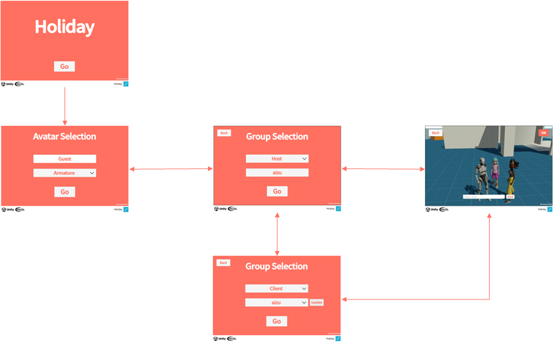

# Introduction

This section describes the sample application features.

One of Extreal's goals is to provide a foundation for virtual spaces where people can gather and communicate.
We provide "Holiday" as a sample application equipped with the multiplayer and voice chat features necessary for such a virtual space.

Holiday has a simple stage structure: title screen -> avatar selection screen -> virtual space.
In the future, Holiday's features will increase as Extreal's features increase.

Holiday will provide the following contents

- [Requirements](/sample-app/requirements)
  - Functional and non-functional requirements for Holiday
- [Architecture](/sample-app/architecture)
  - System and application architecture to realize Holiday's requirements
- [Test Planning](/sample-app/test-planning)
  - How to test Holiday's requirements and test contents
- [Development Guid](/sample-app/dev-guide)
  - How to create Holiday and development rules
- [Repository](https://github.com/extreal-dev/Extreal.SampleApp.Holiday)
  - An application (Unity project) that realizes the requirements of Holiday

We encourage you to use these contents for the following purposes

- Learn how to create applications using Extreal
- Use Extreal as a basis for application development
