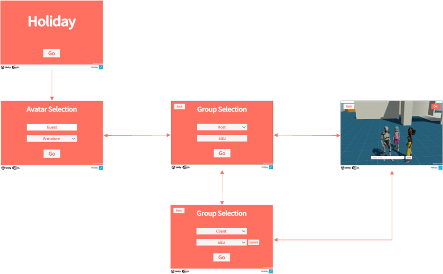

# Requirements

Here are the requirements realized by Holiday.

:::caution
Holiday requirements do not cover those necessary for production applications.
For production applications, please refer to [Non-Functional Requirements Grade](https://www.ipa.go.jp/sec/softwareengineering/std/ent03-b.html) to identify the perspective of non-functional requirements and define them.
:::

## Functional requirements

Holiday is an application aimed at gathering with friends and family to spend time together during the holidays.

- Title Screen
  - Title display only
- Avatar selection screen
  - Allows users to enter a name
  - Allows users to select an avatar
    - Armature of [Starter Assets - Third Person Character Controller](https://assetstore.unity.com/packages/essentials/starter-assets-third-person-character-controller-196526?locale=en-JP)
    - Michelle and Amy from [Mixamo](https://www.mixamo.com)
- Group selection screen
  - Allows users to select Host or Client
  - For host, groups can be created by specifying a group name
  - For client, you can select a group and join the group
  - Can return to avatar selection screen
- Virtual Space
  - Voice chat is available
  - Text chat is available
  - Multiplayer is available
  - Can switch space
  - Can return to group selection screen

## Non-functional requirements

- Method of holding the event
  - Each event will be held for one hour, with a set schedule and event announcement
  - The server is started/stopped each time the event is held
- Number of users
  - Multiplayer
    - 70 users per space
  - Text/Voice chat
    - 10 users per group
  - If the maximum number of users is exceeded, users are notified on the group selection screen.
  - No limit on number of groups
- Usage environment
  - PC Browser
    - Windows 10
    - Chrome
  - PC application
    - Windows 10
  - Mobile application
    - iOS 16（TODO: 性能テストの実態に合わせてバージョン修正）
    - Android 11（TODO: 性能テストの実態に合わせてバージョン修正）
  - Internet connection
    - Up/Down stream: 40 Mbps or higher
- Assets
  - Assets are not included in the application, and are downloaded at application runtime.
    - Models such as avatar characters, virtual spaces, etc., and text such as titles, messages, etc.
    - Asset downloads will display the download size and confirm execution to the user.
- Application usage visualization
  - User usage
    - Number of unique users
    - Stay time per stage
    - Number of text chats sent
  - Resource usage
    - Memory usage of the application
  - Error status
    - Number of errors
- External Connections
  - Asset download (S3)
    - When the network is disconnected, reconnect.
      - The reconnection status is notified to the user.
      - If reconnection fails, further reconnection is done by user operation (screen transition).
  - Multiplayer, text chat (Messaging)
    - When the network is disconnected, the user is notified.
    - All features are available except for multiplayer and text chat.
    - Reconnection processing is not necessary because the user can reconnect when re-entering the virtual space.
  - Voice chat (P2P)
    - When the network is disconnected, the user is notified.
    - All features are available except for voice chat.
    - Reconnection processing is not necessary because the user can reconnect when re-entering the virtual space.
  - Application usage visualization (Grafana/Loki)
    - No reconnection or user notification will be made because user play will not be affected.
    - All features are available.
  - Download 360-degree videos/images for use in the background of the space (S3)
    - When the network is disconnected, the user is notified.
- Region, Language
  - Japan, Japanese only
