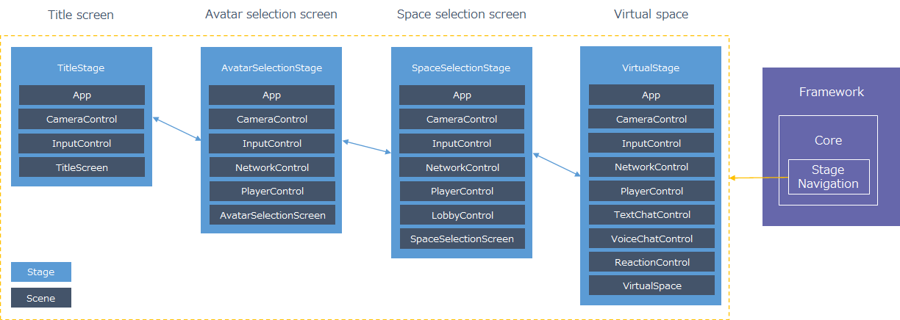
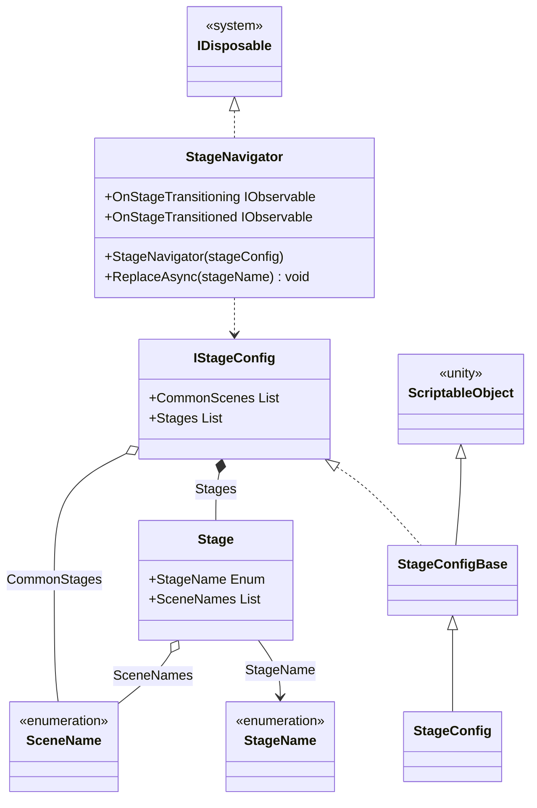
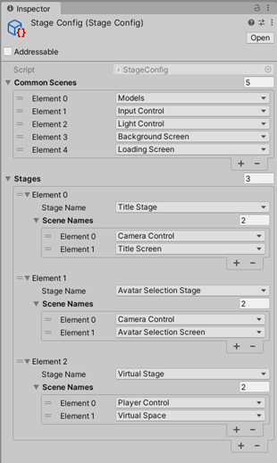

# Stage Navigation

## What for?

Stage Navigation is provided to easily create stages that combine multiple scenes and switch between stages as described in [the application architecture assumed by Framework](../intro.md#application).

The diagram shown in [the application architecture assumed by Framework](../intro.md#application) is reproduced below.


If you are able to create stages in your application using Stage Navigation and freely combining features, you will have an application that is easier to maintain and more reusable.

## Specification

Stage Navigation specifications are as follows.

- Stages can be set by combining multiple scenes.
- Scenes common to all stages can be set together in one place.
- You can transition to a specified stage.
- Processing can be added to trigger stage transitions.

## Architecture



:::info
The following types are created in the application

- StageName: Enum representing the stage name
- SceneName: Enum representing the scene name
- StageConfig: Class that holds the stage configuration
:::

## Installation

### Package

```text
https://github.com/extreal-dev/Extreal.Core.StageNavigation.git
```

### Dependencies

Stage Navigation uses the following packages.

- [Extreal.Core.Logging](./logging.md)
- [UniTask](https://github.com/Cysharp/UniTask)
- [UniRx](https://github.com/neuecc/UniRx)

Please refer to [Release](../category/release) for the correspondence between module version and each package version.

### Settings

The stages to be used in the application are set up.
You create the following three types.

- Enum representing the stage name
- Enum that represents the scene name
- Class that holds the stage settings

```csharp
// Enum for the stage name
public enum StageName
{
    TitleStage = 0,
    AvatarSelectionStage = 1,
    SpaceSelectionStage = 2,
    VirtualStage = 3,
}
```

```csharp
// Enum for the scene name
public enum SceneName
{
    // Control
    CameraControl = 100,
    InputControl = 101,
    NetworkControl = 102,
    PlayerControl = 103,
    LobbyControl = 104,
    TextChatControl = 105,
    VoiceChatControl = 106,
    ReactionControl = 107,
    
    // Screen
    TitleScreen = 200,
    AvatarSelectionScreen = 201,
    SpaceSelectionScreen = 202,

    // Space
    VirtualSpace = 300,
}
```

Constant values, like stage configuration, can be specified in the Unity editor's inspector for easier editing.
Enums for stage and scene names should be constant values because of the following problem when using Enums in the inspector

:::caution
The C# specification automatically assigns constant values to Enums in the order in which they are defined, from the top.
If you specify an Enum in the Inspector of the Unity Editor, the state is saved as a constant value, so if the definition order changes when the Enum is changed, the Inspector setting value will also unintentionally change.
To deal with this problem, specify a constant value for the Enum used in the inspector.
The constant value has no meaning other than identification, so any number can be used as long as it does not duplicate in each Enum.
:::

The IStageConfig interface holds the stage configuration.
A Base class inheriting from ScriptableObject is provided so that the stage configuration can be edited in the inspector of the Unity editor.
The class that holds the stage configuration should inherit from the StageConfigBase class.

```csharp
// Class that holds the stage config
[CreateAssetMenu(
    menuName = "Config/" + nameof(StageConfig),
    fileName = nameof(StageConfig))]
public class StageConfig : StageConfigBase<StageName, SceneName>
{
}
```

The stage configuration is set up in the Unity editor inspector.
An example configuration is as follows.



- CommonScenes property
  - Specifies scenes common to all stages.
- Stages property
  - Specifies the scene configuration for each stage.

VContainer is used to initialize StageNavigator and StageConfig.

```csharp
    public class AppScope : LifetimeScope
    {
        [SerializeField] private StageConfig stageConfig;

        protected override void Configure(IContainerBuilder builder)
        {
            builder.RegisterComponent(stageConfig).AsImplementedInterfaces();
            builder.Register<StageNavigator<StageName, SceneName>>(Lifetime.Singleton);
        }
    }
```

## Usage

### Transition to the specified stage

It transitions to the specified stage using StageNavigator's ReplaceAsync.

```csharp
// Transition to the title stage
stageNavigator.ReplaceAsync(StageName.TitleStage);

// Transition to the avatar selection stage
stageNavigator.ReplaceAsync(StageName.AvatarSelectionStage);

// Transition to the space selection stage
stageNavigator.ReplaceAsync(StageName.SpaceSelectionStage);
```

If a stage transition continues with the same scene, StageNavigator will reuse the scene without reloading it to reduce processing time.

```text
TitleStage
  PlayerControl -> Loaded
  TitleScreen -> Loaded

AvatarSelectionStage
  PlayerControl -> Not loading
  AvatarSelectionScreen -> Loaded

SpaceSelectionStage
  PlayerControl -> Not loading
  AvatarSelectionScreen -> Loaded
```

Awake and Start of GameObjects in reused scenes are executed only at the time they are loaded, not at the time they are reused.
If you want to execute processing at the timing of stage transitions, use [event notification](#core-sn-event) published by StageNavigator.

### Add processing to trigger stage transitions {#core-sn-event}

StageNavigator has the following event notifications.

- OnStageTransitioning
  - Timing: Just before the stage transition
  - Type: IObservable
  - Parameters: Name of the stage to be transitioned
- OnStageTransitioned
  - Timing: Immediately after the stage transition
  - Type: IObservable
  - Parameter: Name of the stage that has transitioned

The following is an example of log output at the timing of OnStageTransitioned.

```csharp
stageNavigator.OnStageTransitioned.Subscribe(stageName =>
{
    Logger.LogInfo(stageName);
}).AddTo(compositeDisposable);
```
