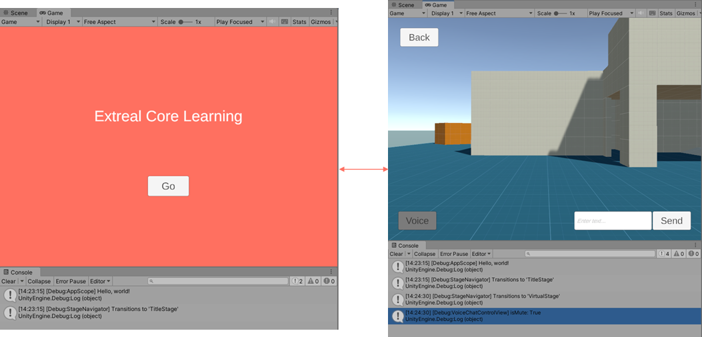
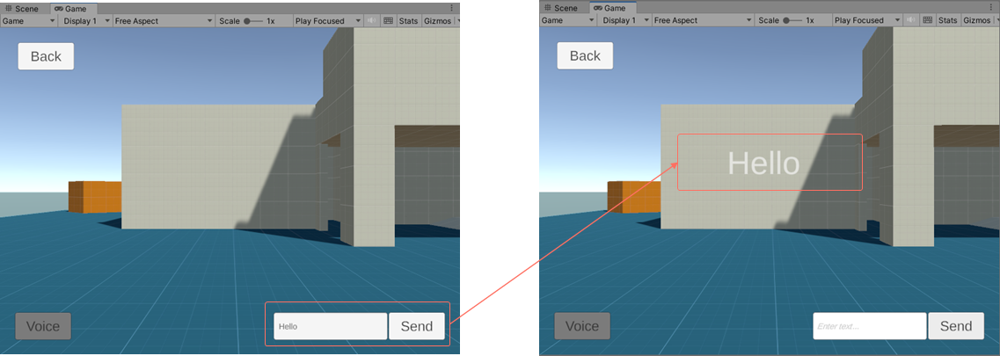
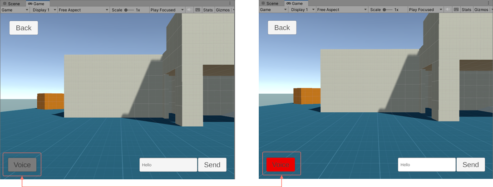
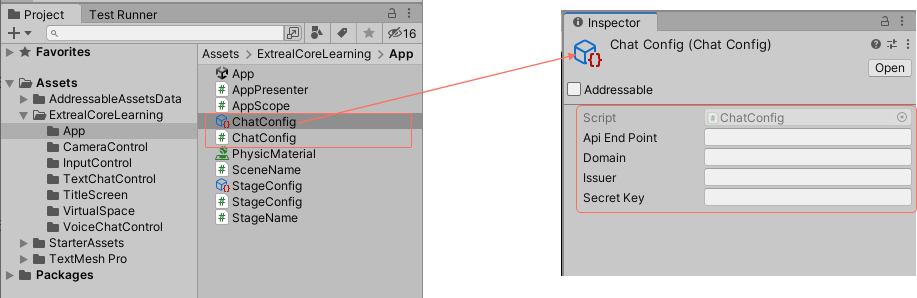
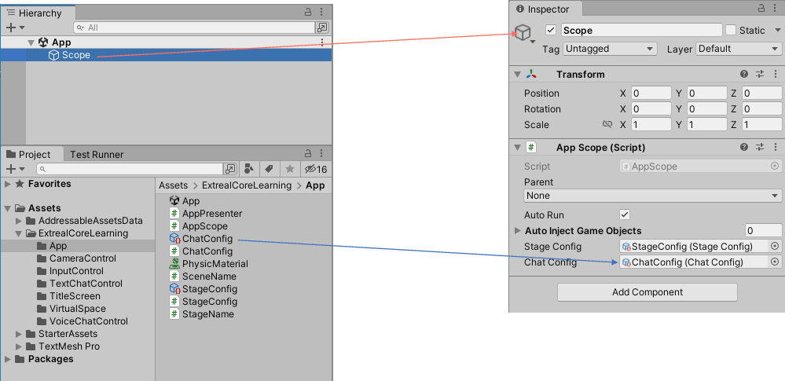
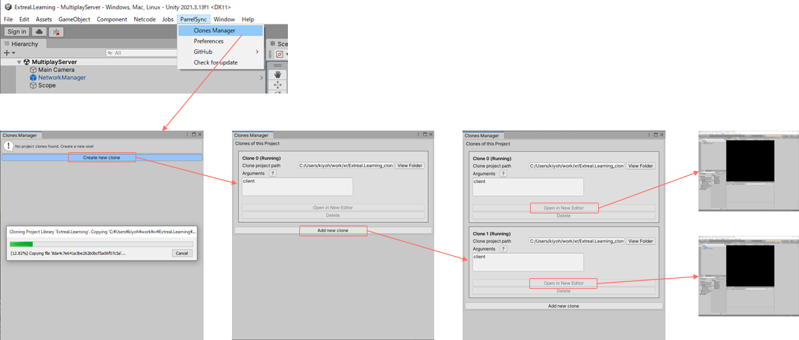

# Chat using Vivox

In this section, you will learn about the [Vivox wrapper](../integration/chat.vivox.md).

- Approximate learning time
  - 60 min.
- Unity Version
  - 2021.3.16f1

The Vivox wrapper learning process uses a project prepared for learning.
This learning project is based on the application architecture built in the Core learning.
If you have not learned Core, it is recommended that you learn [Learning Core](./core.md) before learning this project.

Using the learning project with the Vivox wrapper set up, we will add an implementation of the application to allow text and voice chat in virtual space.

You will need to have an application on the [Vivox Developer Portal](https://developer.vivox.com/) to connect to from the client to do this learning.
Please create an application on the [Vivox Developer Portal](https://developer.vivox.com/) before starting the following hands-on activities.

## Prepare project

:::info step
First, prepare your project.
:::

Clone the learning project.

```text
https://github.com/extreal-dev/Extreal.Learning.Chat.Vivox.git
```

Open the cloned project in the Unity editor.
If the message "Link your Unity project" appears, close it without setting it.

:::info step
Review the project contents.
:::

The `ExtrealCoreLearning` directory in the Assets directory is the directory that contains the assets for the application.
We control the dependent packages by creating an Assembly Definition with the same name as the directory name.

The state of the `ExtrealCoreLearning` directory is as follows.

- The title screen and virtual space have already been created
- The virtual space uses assets provided by [Starter Assets - Third Person Character Controller](http://u3d.as/2z1r)
- UIs for text chat and voice chat have already been created in the virtual space
- Text chat and voice chat are realized in the virtual space

:::info step
Let's run the application to make sure there are no problems with the project.
:::

Run the `App` scene in the App directory.
It is successful if you can press the Go button on the title screen to move to the virtual space.



Try the text chat UI.
Enter an appropriate message in the input field and press the Send button.
The message will appear on the screen.



The Voice Chat UI provides a button to toggle mute.
Press the Voice button in the lower left corner of the screen.
The color of the button changes according to the mute status.
Red indicates unmuted and gray indicates muted.



Check the following directories for UI implementations of text and voice chat.

- Text chat
  ```text
  ExtrealCoreLearning/TextChatControl
  ```
- Voice chat
  ```text
  ExtrealCoreLearning/VoiceChatControl
  ```

We will add an implementation to allow text and voice chat in the virtual space.

## Add VivoxClient

First, prepare a VivoxClient.
Since only one VivoxClient needs to exist in the application, it should be included in the App scene so that it can be reused even if the space increases.

:::info step
Create a ScriptableObject that generates the VivoxAppConfig.
:::



- Create a ChatConfig script that creates a VivoxAppConfig object in the App directory, referring to [Settings in the Vivox wrapper](../integration/chat.vivox.md#settings).
- Create a ChatConfig object from the Create Asset menu and set the connection information to Vivox in the inspector.

:::info step
Initialize VivoxClient by changing AppScope.
:::

Set VivoxAppConfig to VivoxClient using VContainer.

```csharp
using Extreal.Core.Logging;
using Extreal.Core.StageNavigation;
// highlight-start
using Extreal.Integration.Chat.Vivox;
// highlight-end
using UnityEngine;
using VContainer;
using VContainer.Unity;

namespace ExtrealCoreLearning.App
{
    public class AppScope : LifetimeScope
    {
        [SerializeField] private StageConfig stageConfig;
        // highlight-start
        [SerializeField] private ChatConfig chatConfig;
        // highlight-end

        private static void InitializeApp()
        {
            // Omitted due to no changes
        }

        protected override void Awake()
        {
            // Omitted due to no changes
        }

        protected override void Configure(IContainerBuilder builder)
        {
            builder.RegisterComponent(stageConfig).AsImplementedInterfaces();
            builder.Register<StageNavigator<StageName, SceneName>>(Lifetime.Singleton);

            // highlight-start
            builder.RegisterComponent(chatConfig.ToVivoxAppConfig());
            builder.Register<VivoxClient>(Lifetime.Singleton);
            // highlight-end

            builder.RegisterEntryPoint<AppPresenter>();
        }
    }
}
```

Set the ChatConfig object to AppScope in the Inspector.



## Add text chat

Now that VivoxClient is ready, we will add text chat.

:::info step
Create a Model script that provides the logic for text chat.
:::

Create it in the ExtrealCoreLearning/TextChatControl directory.
It provides for joining and leaving the channel, sending and receiving messages.
When joining a channel, log in if the user is not logged in.

```csharp
using System;
using Cysharp.Threading.Tasks;
using Extreal.Integration.Chat.Vivox;
using UniRx;
using VivoxUnity;

namespace ExtrealCoreLearning.TextChatControl
{
    public class TextChatChannel : IDisposable
    {
        private readonly VivoxClient vivoxClient;
        private readonly string channelName;

        private ChannelId channelId;

        private readonly CompositeDisposable disposables = new CompositeDisposable();
        
        public IObservable<string> OnMessageReceived
            => vivoxClient.OnTextMessageReceived.Select(channelTextMessage => channelTextMessage.Message);

        public TextChatChannel(VivoxClient vivoxClient, string channelName)
        {
            this.vivoxClient = vivoxClient;
            this.channelName = channelName;
            this.vivoxClient.OnChannelSessionAdded
                .Where(channelId => channelId.Name == this.channelName)
                .Subscribe(channelId => this.channelId = channelId)
                .AddTo(disposables);
        }

        public async UniTask JoinAsync()
        {
            if (!IsLoggedIn)
            {
                Login();
            }
            await UniTask.WaitUntil(() => IsLoggedIn);
            vivoxClient.ConnectAsync(new VivoxChannelConfig(channelName, ChatType.TextOnly, transmissionSwitch: false)).Forget();
        }

        private bool IsLoggedIn
            => vivoxClient.LoginSession?.State == LoginState.LoggedIn;

        private void Login()
        {
            vivoxClient.LoginAsync(new VivoxAuthConfig(nameof(TextChatChannel))).Forget();
        }

        public void Leave()
        {
            if (!IsLoggedIn)
            {
                return;
            }
            vivoxClient.Disconnect(channelId);
        }

        public void SendMessage(string message)
        {
            if (!IsLoggedIn)
            {
                return;
            }
            vivoxClient.SendTextMessage(message, channelId);
        }

        public void Dispose()
        {
            disposables.Dispose();
        }
    }
}
```

:::info step
Change TextChatControlPresenter to use TextChatChannel.
:::

A TextChatChannel is created and the user joins the channel when entering the stage, and he/she leaves the channel when exiting the stage.
Sending and receiving messages are realized by mapping TextChatControlView of the View script to TextChatChannel of the Model script.

```csharp
using System;
// highlight-start
using Cysharp.Threading.Tasks;
// highlight-end
using Extreal.Core.Common.System;
// highlight-start
using Extreal.Core.StageNavigation;
using Extreal.Integration.Chat.Vivox;
using ExtrealCoreLearning.App;
// highlight-end
using UniRx;
using VContainer.Unity;

namespace ExtrealCoreLearning.TextChatControl
{
    public class TextChatControlPresenter : IInitializable, IDisposable
    {
        // highlight-start
        private readonly StageNavigator<StageName, SceneName> stageNavigator;
        private readonly VivoxClient vivoxClient;
        // highlight-end
        private readonly TextChatControlView textChatControlView;
        private readonly CompositeDisposable disposables = new CompositeDisposable();

        // highlight-start
        private TextChatChannel textChatChannel;
        private readonly CompositeDisposable stageDisposables = new CompositeDisposable();

        public TextChatControlPresenter(
            StageNavigator<StageName, SceneName> stageNavigator,
            VivoxClient vivoxClient,
            TextChatControlView textChatControlView)
        // highlight-end
        {
            // highlight-start
            this.stageNavigator = stageNavigator;
            this.vivoxClient = vivoxClient;
            // highlight-end
            this.textChatControlView = textChatControlView;
        }

        public void Initialize()
        {
            // highlight-start
            stageNavigator.OnStageTransitioned
                .Subscribe(OnStageEntered).AddTo(disposables);

            stageNavigator.OnStageTransitioning
                .Subscribe(OnStageExiting).AddTo(disposables);
            // highlight-end

            textChatControlView.OnSendButtonClicked.Subscribe(message =>
            {
                // highlight-start
                textChatChannel.SendMessage(message);
                // highlight-end
            }).AddTo(disposables);
        }

        // highlight-start
        private void OnStageEntered(StageName stageName)
        {
            textChatChannel = new TextChatChannel(vivoxClient, $"TextChat-{stageName}");
            textChatChannel.OnMessageReceived.Subscribe(message =>
            {
                textChatControlView.ShowTextChatMessage(message);
            }).AddTo(stageDisposables);
            textChatChannel.JoinAsync().Forget();
        }

        private void OnStageExiting(StageName stageName)
        {
            textChatChannel.Leave();
            textChatChannel.Dispose();
            stageDisposables.Clear();
        }
        // highlight-end

        public void Dispose()
        {
            // highlight-start
            stageDisposables.Dispose();
            // highlight-end
            disposables.Dispose();
        }
    }
}
```

:::info step
Play text chat.
:::

Use [ParrelSync](https://github.com/VeriorPies/ParrelSync) to check how text chat works.
Since ParrelSync is installed in the project, open multiple Unity editors using ParrelSync and play with them.



Run the App scene.
It may take some time to connect to Vivox, so if you send a message immediately after execution, it may not be sent.
If the message does not respond, please send a message after a short wait.

If the message is sent to all running applications, it is successful.

## Add base class

Before adding voice chat, we will cut out the common processing in the Base class since the Model and Presenter scripts for text and voice chat have many parts in common.
The common processing is as follows.

- Model script
  - Joining and leaving a channel
  - When joining a channel, log in if the user is not logged in.
- Presenter script
  - Creates a TextChatChannel and joins the channel when entering the stage, and leaves the channel when exiting the stage

:::info step
Create a Base class for the Model script.
:::

Create it in the App directory.

```csharp
using System;
using Cysharp.Threading.Tasks;
using Extreal.Integration.Chat.Vivox;
using ExtrealCoreLearning.TextChatControl;
using UniRx;
using VivoxUnity;

namespace ExtrealCoreLearning.App
{
    public abstract class ChatChannelBase : IDisposable
    {
        protected readonly VivoxClient VivoxClient;
        protected readonly string ChannelName;
        protected ChannelId ChannelId;

        protected readonly CompositeDisposable Disposables = new CompositeDisposable();

        protected ChatChannelBase(VivoxClient vivoxClient, string channelName)
        {
            VivoxClient = vivoxClient;
            ChannelName = channelName;
            VivoxClient.OnChannelSessionAdded
                .Where(channelId => channelId.Name == ChannelName)
                .Subscribe(channelId => ChannelId = channelId)
                .AddTo(Disposables);
        }

        public async UniTask JoinAsync()
        {
            if (!IsLoggedIn)
            {
                Login();
            }

            await UniTask.WaitUntil(() => IsLoggedIn);
            Connect();
        }

        protected bool IsLoggedIn
            => VivoxClient.LoginSession?.State == LoginState.LoggedIn;

        private void Login()
        {
            VivoxClient.LoginAsync(new VivoxAuthConfig(nameof(TextChatChannel))).Forget();
        }

        protected abstract void Connect();

        public void Leave()
        {
            if (!IsLoggedIn)
            {
                return;
            }

            VivoxClient.Disconnect(ChannelId);
        }

        public void Dispose()
        {
            Disposables.Dispose();
        }
    }
}
```

:::info step
Change TextChatChannel to use Base class.
:::

```csharp
using System;
using Cysharp.Threading.Tasks;
using Extreal.Integration.Chat.Vivox;
using ExtrealCoreLearning.App;
using UniRx;

namespace ExtrealCoreLearning.TextChatControl
{
    public class TextChatChannel : ChatChannelBase
    {
        public IObservable<string> OnMessageReceived
            => VivoxClient.OnTextMessageReceived.Select(channelTextMessage => channelTextMessage.Message);

        public TextChatChannel(VivoxClient vivoxClient, string channelName) : base(vivoxClient, channelName)
        {
        }

        protected override void Connect()
        {
            VivoxClient.ConnectAsync(new VivoxChannelConfig(ChannelName, ChatType.TextOnly, transmissionSwitch: false)).Forget();
        }

        public void SendMessage(string message)
        {
            if (!IsLoggedIn)
            {
                return;
            }

            VivoxClient.SendTextMessage(message, ChannelId);
        }
    }
}
```

:::info step
Create a Base class for the Presenter script.
:::

Create it in the App directory.

```csharp
using System;
using Extreal.Core.StageNavigation;
using UniRx;
using VContainer.Unity;

namespace ExtrealCoreLearning.App
{
    public abstract class ControlPresenterBase : IInitializable, IDisposable
    {
        private readonly StageNavigator<StageName, SceneName> stageNavigator;
        private readonly CompositeDisposable sceneDisposables = new CompositeDisposable();
        private CompositeDisposable stageDisposables = new CompositeDisposable();

        protected ControlPresenterBase(
            StageNavigator<StageName, SceneName> stageNavigator)
        {
            this.stageNavigator = stageNavigator;
        }

        public void Initialize()
        {
            stageNavigator.OnStageTransitioned.Subscribe(stageName =>
            {
                OnStageEntered(stageName, stageDisposables);
            }).AddTo(sceneDisposables);

            stageNavigator.OnStageTransitioning.Subscribe(stageName =>
            {
                OnStageExiting(stageName);
                stageDisposables.Clear();
            }).AddTo(sceneDisposables);

            Initialize(stageNavigator, sceneDisposables);
        }

        protected abstract void Initialize(
            StageNavigator<StageName, SceneName> stageNavigator, CompositeDisposable sceneDisposables);

        protected abstract void OnStageEntered(
            StageName stageName, CompositeDisposable stageDisposables);

        protected abstract void OnStageExiting(StageName stageName);

        public void Dispose()
        {
            stageDisposables.Dispose();
            sceneDisposables.Dispose();
        }
    }
}
```

:::info step
Change TextChatControlPresenter to use Base class.
:::

```csharp
using Cysharp.Threading.Tasks;
using Extreal.Core.StageNavigation;
using Extreal.Integration.Chat.Vivox;
using ExtrealCoreLearning.App;
using UniRx;

namespace ExtrealCoreLearning.TextChatControl
{
    public class TextChatControlPresenter : ControlPresenterBase
    {
        private readonly VivoxClient vivoxClient;
        private readonly TextChatControlView textChatControlView;
        private TextChatChannel textChatChannel;

        public TextChatControlPresenter(
            StageNavigator<StageName, SceneName> stageNavigator,
            VivoxClient vivoxClient,
            TextChatControlView textChatControlView) : base(stageNavigator)
        {
            this.vivoxClient = vivoxClient;
            this.textChatControlView = textChatControlView;
        }

        protected override void Initialize(
            StageNavigator<StageName, SceneName> stageNavigator,
            CompositeDisposable sceneDisposables)
        {
            textChatControlView.OnSendButtonClicked
                .Subscribe(message =>
                {
                    textChatChannel.SendMessage(message);
                }).AddTo(sceneDisposables);
        }

        protected override void OnStageEntered(
            StageName stageName,
            CompositeDisposable stageDisposables)
        {
            textChatChannel = new TextChatChannel(vivoxClient, $"TextChat-{stageName}");
            textChatChannel.OnMessageReceived
                .Subscribe(message =>
                {
                    textChatControlView.ShowTextChatMessage(message);
                }).AddTo(stageDisposables);
            textChatChannel.JoinAsync().Forget();
        }

        protected override void OnStageExiting(StageName stageName)
        {
            textChatChannel.Leave();
            textChatChannel.Dispose();
        }
    }
}
```

If you can run the App scene and play text chat as before the change, it is successful.

## Add voice chat

We will add voice chat.

:::info step
Change the VoiceChatChannel in the Model script to use the Base class and VivoxClient.
:::

This uses VivoxClient to control the mute of the input device.

```csharp
using System;
using Cysharp.Threading.Tasks;
using Extreal.Integration.Chat.Vivox;
using ExtrealCoreLearning.App;
using UniRx;

namespace ExtrealCoreLearning.VoiceChatControl
{
    public class VoiceChatChannel : ChatChannelBase
    {
        public IObservable<bool> IsMute => isMute.AddTo(Disposables);
        private ReactiveProperty<bool> isMute = new ReactiveProperty<bool>();

        public VoiceChatChannel(VivoxClient vivoxClient, string channelName) : base(vivoxClient, channelName)
        {
            SetMuteAsync(true).Forget();
        }

        protected override void Connect()
        {
            VivoxClient.ConnectAsync(new VivoxChannelConfig(ChannelName, ChatType.AudioOnly)).Forget();
        }

        public UniTask ToggleMuteAsync()
        {
            return SetMuteAsync(!isMute.Value);
        }

        private async UniTask SetMuteAsync(bool muted)
        {
            var audioInputDevices = await VivoxClient.GetAudioInputDevicesAsync();
            audioInputDevices.Muted = muted;
            isMute.Value = muted;
        }
    }
}
```

:::info step
Modify VoiceChatControlPresenter to use Base class and VoiceChatChannel.
:::

```csharp
using Cysharp.Threading.Tasks;
using Extreal.Core.StageNavigation;
using Extreal.Integration.Chat.Vivox;
using ExtrealCoreLearning.App;
using UniRx;

namespace ExtrealCoreLearning.VoiceChatControl
{
    public class VoiceChatControlPresenter : ControlPresenterBase
    {
        private readonly VivoxClient vivoxClient;
        private readonly VoiceChatControlView voiceChatControlView;
        private VoiceChatChannel voiceChatChannel;

        public VoiceChatControlPresenter(
            StageNavigator<StageName, SceneName> stageNavigator,
            VivoxClient vivoxClient,
            VoiceChatControlView voiceChatControlView) : base(stageNavigator)
        {
            this.vivoxClient = vivoxClient;
            this.voiceChatControlView = voiceChatControlView;
        }

        protected override void Initialize(
            StageNavigator<StageName, SceneName> stageNavigator, CompositeDisposable sceneDisposables)
        {
            voiceChatControlView.OnVoiceButtonClicked.Subscribe(_ =>
            {
                voiceChatChannel.ToggleMuteAsync().Forget();
            }).AddTo(sceneDisposables);
        }

        protected override void OnStageEntered(StageName stageName, CompositeDisposable stageDisposables)
        {
            voiceChatChannel = new VoiceChatChannel(vivoxClient, $"VoiceChat-{stageName}");
            voiceChatChannel.IsMute.Subscribe(isMute =>
            {
                voiceChatControlView.toggleMute(isMute);
            }).AddTo(stageDisposables);
            voiceChatChannel.JoinAsync().Forget();
        }

        protected override void OnStageExiting(StageName stageName)
        {
            voiceChatChannel.Leave();
            voiceChatChannel.Dispose();
        }
    }
}
```

:::info step
Play voice chat.
:::

Open and play multiple Unity editors using ParrelSync.

Run the App scene.
Toggle mute, if the voice is sent to all running applications, it is successful.

## Next Step

This concludes our hands-on with the Vivox wrapper.
Thank you for your time.

Through this hands-on, you have experienced how to create text and voice chats using the [Vivox wrapper](../integration/chat.vivox.md).
As a next step, you might be interested in how the Vivox wrapper can be used in a more serious application.
To meet your expectations, we provide [Sample Application](../../category/sample-application) as an example of a full-scale implementation.
Please take a look at [Sample Application](../../category/sample-application).
