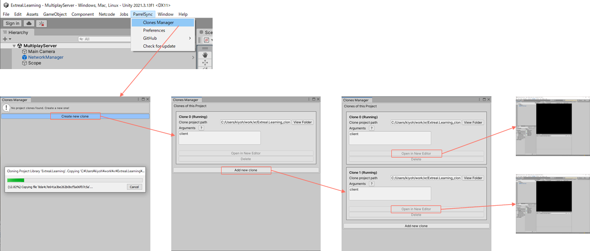

# Multiplay using Netcode for GameObjects

In this section, you will learn about the [NGO wrapper](../integration/multiplay.ngo.md).

- Approximate learning time
  - 60 min.
- Unity Version
  - 2021.3.16f1

The NGO wrapper learning process uses a project prepared for learning.
This learning project is based on the application architecture built in the Core learning.
If you have not learned Core, it is recommended that you learn [Learning Core](./core.md) before learning this project.

Using the learning project with the NGO wrapper set up, we will add server and application implementations to allow multiplayer in virtual space.

## Prepare project

:::info step
First, prepare your project.
:::

Clone the learning project.

```text
https://github.com/extreal-dev/Extreal.Learning.Multiplay.NGO.git
```

Open the cloned project in the Unity editor.

:::info step
Review the project contents.
:::

The following three directories are created in the `Assets` directory.
In each directory, we create an Assembly Definition with the same name as the directory name to control the dependent packages.

- ExtrealCoreLearning
  - This directory contains the assets of the application
  - The title screen and virtual space have already been created
    - The virtual space uses assets provided by [Starter Assets - Third Person Character Controller](http://u3d.as/2z1r)
    - The virtual space will be used for multiplayer
  - Add a client implementation of multiplayer with this hands-on
- ExtrealCoreLearning.MultiplayServer
  - This directory contains the assets for the multiplayer server
  - Add a multiplayer server implementation with this hands-on
- ExtrealCoreLearning.MultiplayCommon
  - Directory to store assets common to the application and the multiplayer server
  - Player prefabs supporting the NGO have already been created
    - The player prefab uses assets provided by [Starter Assets - Third Person Character Controller](http://u3d.as/2z1r)
  - Add NetworkManager with this hands-on

:::info step
Let's run the application to make sure there are no problems with the project.
:::

Run the `App` scene in the ExtrealCoreLearning/App directory.
It is successful if you can press the Go button on the title screen to move to the virtual space.


We will add an implementation to allow multiplayer in the virtual space.

## Add multiplayer server

First, add a multiplayer server.

:::info step
Create a Model script that provides the logic for the multiplayer server.
:::

Create it in the ExtrealCoreLearning.MultiplayServer directory.
Start the server with NgoServer.
Later, we will add the processing to spawn players upon receiving a message from the client.

```csharp
using Cysharp.Threading.Tasks;
using Extreal.Integration.Multiplay.NGO;

namespace ExtrealCoreLearning.MultiplayServer
{
    public class MultiplayServer
    {
        private readonly NgoServer ngoServer;

        public MultiplayServer(NgoServer ngoServer)
        {
            this.ngoServer = ngoServer;
        }

        public UniTask StartAsync()
        {
            return ngoServer.StartServerAsync();
        }
    }
}
```

:::info step
Create a Presenter script that will be the entry point for the multiplayer server.
:::

Create it in the ExtrealCoreLearning.MultiplayServer directory.
Start the server when the MultiplayServer scene runs.

```csharp
using Cysharp.Threading.Tasks;
using VContainer.Unity;

namespace ExtrealCoreLearning.MultiplayServer
{
    public class MultiplayServerPresenter : IStartable
    {
        private readonly MultiplayServer multiplayServer;

        public MultiplayServerPresenter(MultiplayServer multiplayServer)
        {
            this.multiplayServer = multiplayServer;
        }

        public void Start()
        {
            multiplayServer.StartAsync().Forget();
        }
    }
}
```

:::info step
Create a Scope script to assemble the necessary objects for a multiplayer server.
:::

Create it in the ExtrealCoreLearning.MultiplayServer directory.
We want to output debug logs, so we include initialization of Logging.
The NetworkManager is placed as a GameObject, so we receive it from the inspector.

```csharp
using Extreal.Core.Logging;
using Extreal.Integration.Multiplay.NGO;
using Unity.Netcode;
using UnityEngine;
using VContainer;
using VContainer.Unity;
using LogLevel = Extreal.Core.Logging.LogLevel;

namespace ExtrealCoreLearning.MultiplayServer
{
    public class MultiplayServerScope : LifetimeScope
    {
        [SerializeField] private NetworkManager networkManager;

        private static void InitializeApp()
        {
            const LogLevel logLevel = LogLevel.Debug;
            LoggingManager.Initialize(logLevel: logLevel);
        }

        protected override void Awake()
        {
            InitializeApp();
            base.Awake();
        }

        protected override void Configure(IContainerBuilder builder)
        {
            builder.RegisterComponent(networkManager);
            builder.Register<NgoServer>(Lifetime.Singleton);
            builder.Register<MultiplayServer>(Lifetime.Singleton);

            builder.RegisterEntryPoint<MultiplayServerPresenter>();
        }
    }
}
```

:::info step
Create a GameObject with NetworkManager attached in the MultiplayServer scene.
:::


- Create a GameObject named `NetworkManager` in the MultiplayServer scene
- Add `Network Manager` from the Inspector's `Add Component`
- Select `UnityTransport` from `Select transport...` in the inspector
- **Uncheck `Scene Management>Enable Scene Management` in the inspector, as the scene is managed by StageNavigation**

:::info step
Set Scope script to MultiplayServer scene.
:::


- Create a GameObject with the MultiplayServerScope script attached to the MultiplayServer scene with the name `Scope`
- Set the NetworkManager object in the inspector

:::info step
Run the multiplayer server.
:::

Run the MultiplayServer scene.
If the Console outputs `[Debug:NgoServer] The server has started`, it is successful.


## Commonize NetworkManager

NetworkManager must be configured the same on the server and client, so it is prefabricated and the same objects are available from the server and client.

:::info step
Change the NetworkManager object to prefabricated.
:::

Drag and drop the NetworkManager object from the MultiplayServer scene into the `ExtrealCoreLearning.MultiplayCommon` directory.


## Add connection to multiplay room

Add joining and leaving a Multiplayer Room to the application.

:::info step
First, initialize the NgoClient to be used by the application.
:::

Initializing NgoClient requires NetworkManager.
Since we only need one NgoClient and one NetworkManager in the application, we will include them in the App scene so that they can be reused when more space is available.

Modify the `AppScope` script to initialize NgoClient.

```csharp
using Extreal.Core.Logging;
using Extreal.Core.StageNavigation;
// highlight-start
using Extreal.Integration.Multiplay.NGO;
using Unity.Netcode;
// highlight-end
using UnityEngine;
using VContainer;
using VContainer.Unity;
// highlight-start
using LogLevel = Extreal.Core.Logging.LogLevel;
// highlight-end

namespace ExtrealCoreLearning.App
{
    public class AppScope : LifetimeScope
    {
        [SerializeField] private StageConfig stageConfig;

        // highlight-start
        [SerializeField] private NetworkManager networkManager;
        // highlight-end

        private static void InitializeApp()
        {
            // Omitted due to no changes
        }

        protected override void Awake()
        {
            // Omitted due to no changes
        }

        protected override void Configure(IContainerBuilder builder)
        {
            builder.RegisterComponent(stageConfig).AsImplementedInterfaces();
            builder.Register<StageNavigator<StageName, SceneName>>(Lifetime.Singleton);

            // highlight-start
            builder.RegisterComponent(networkManager);
            builder.Register<NgoClient>(Lifetime.Singleton);
            // highlight-end

            builder.RegisterEntryPoint<AppPresenter>();
        }
    }
}
```

Drag and drop the NetworkManager prefab in the `ExtrealCoreLearning.MultiplayCommon` directory into the App scene and set it in the inspector of the `AppScope` object.


:::info step
Set the player prefab to NetworkManager.
:::

The prefabs to be synchronized by the NGO must be configured in the NetworkManager.
Set the player prefab `NetworkPlayer` in the `ExtrealCoreLearning.MultiplayCommon` directory to `NetworkPrefabs` in NetworkManager.


:::info step
Check for problems with NgoClient initialization.
:::

If it starts up the same way as before, it is successful.

If `Add Scene to Scenes in Build` is displayed at startup, select `No - Continue` and do the following steps since the NetworkManager creation procedure is omitted.

- **Uncheck `Scene Management>Enable Scene Management` in the inspector since the scene is managed by StageNavigation**

:::info step
Add MultiplayControl scene.
:::

- Create the `ExtrealCoreLearning/MultiplayControl` directory
- Create a `MultiplayControl` scene in the created directory
- Empty the `MultiplayControl` scene by removing the default GameObjects such as cameras

:::info step
Create a Model script that provides the multiplayer logic.
:::

Create it in the ExtrealCoreLearning/MultiplayControl directory.
It provides for joining and leaving a Multiplay room.

```csharp
using Cysharp.Threading.Tasks;
using Extreal.Core.Logging;
using Extreal.Integration.Multiplay.NGO;

namespace ExtrealCoreLearning.MultiplayControl
{
    public class MultiplayRoom
    {
        private static readonly ELogger Logger = LoggingManager.GetLogger(nameof(MultiplayRoom));
        private readonly NgoClient ngoClient;

        public MultiplayRoom(NgoClient ngoClient)
        {
            this.ngoClient = ngoClient;
        }

        public async UniTask JoinAsync()
        {
            await ngoClient.ConnectAsync(new NgoConfig());
            if (Logger.IsDebug())
            {
                Logger.LogDebug("Joined");
            }
        }

        public async UniTask LeaveAsync()
        {
            await ngoClient.DisconnectAsync();
            if (Logger.IsDebug())
            {
                Logger.LogDebug("Left");
            }
        }
    }
}
```

:::info step
Create a Presenter script to control joining and leaving a Multiplayer Room.
:::

Create it in the ExtrealCoreLearning/MultiplayControl directory.
It uses StageNavigator event notifications to control joining and leaving the Multiplay Room.
OnStageTransitioned is after entering the stage and OnStageTransitioning is before exiting the stage.

```csharp
using System;
using Cysharp.Threading.Tasks;
using Extreal.Core.StageNavigation;
using ExtrealCoreLearning.App;
using UniRx;
using VContainer.Unity;

namespace ExtrealCoreLearning.MultiplayControl
{
    public class MultiplayControlPresenter : IInitializable, IDisposable
    {
        private readonly StageNavigator<StageName, SceneName> stageNavigator;
        private readonly MultiplayRoom multiplayRoom;
        private readonly CompositeDisposable disposables = new CompositeDisposable();

        public MultiplayControlPresenter(StageNavigator<StageName, SceneName> stageNavigator,
            MultiplayRoom multiplayRoom)
        {
            this.stageNavigator = stageNavigator;
            this.multiplayRoom = multiplayRoom;
        }

        public void Initialize()
        {
            stageNavigator.OnStageTransitioned
                .Subscribe(_ => multiplayRoom.JoinAsync().Forget())
                .AddTo(disposables);

            stageNavigator.OnStageTransitioning
                .Subscribe(_ => multiplayRoom.LeaveAsync().Forget())
                .AddTo(disposables);
        }

        public void Dispose()
        {
            disposables.Dispose();
        }
    }
}
```

:::info step
Create a Scope script that assembles Model and Presenter objects.
:::

Create it in the ExtrealCoreLearning/MultiplayControl directory.

```csharp
using VContainer;
using VContainer.Unity;

namespace ExtrealCoreLearning.MultiplayControl
{
    public class MultiplayControlScope : LifetimeScope
    {
        protected override void Configure(IContainerBuilder builder)
        {
            builder.Register<MultiplayRoom>(Lifetime.Singleton);

            builder.RegisterEntryPoint<MultiplayControlPresenter>();
        }
    }
}
```

:::info step
Set Scope script to MultiplayControl scene.
:::


- Create a GameObject with the MultiplayControlScope attached to the MultiplayControl scene with the name `Scope`.
- Specify `AppScope` for Parent in the inspector.

:::info step
Now that the MultiplayControl scene is complete, add it to the stage settings and BuildSettings.
:::

- Add `MultiplayControl` to SceneName.
- Add `MultiplayControl` to `VirtualStage` in the StageConfig inspector.
- Add a MultiplayControl scene to BuildSettings.

:::info step
Try if you can connect to a Multiplay room.
:::

Use [ParrelSync](https://github.com/VeriorPies/ParrelSync) to check if Multiplay works.
Since ParrelSync is installed in the project, you can use ParrelSync to open multiple Unity editors and play with them.



The scene to be executed is as follows.

- Multiplayer server
  ```text
  /Assets/ExtrealCoreLearning.MultiplayServer/MultiplayServer
  ```
- Application
  ```text
  /Assets/ExtrealCoreLearning/App/App
  ```

When you move to the virtual space, it is no different than before, but it is successful if you see the following logs.

- Multiplayer server
  ```text
  [Debug:NgoServer] The client with client id 1 has connected
  ```
- Application
  ```text
  [Debug:NgoClient] The client has connected to the server
  ```

## Add player spawn

Now that you have connected to the multiplayer room, add a processing to spawn players.
After adding this processing, you are ready to play multiplayer.

The application sends a message to the multiplayer server requesting to spawn a player, and the multiplayer server spawns the player.

### Application

:::info step
Add a processing to request the multiplayer server to spawn a player.
:::

The player spawn request uses a message provided by the NGO.
The message name must match the application and the multiplayer server, so create an Enum in the `ExtrealCoreLearning.MultiplayCommon` directory to represent the message name.

```csharp
namespace ExtrealCoreLearning.MultiplayCommon
{
    public enum MessageName
    {
        PlayerSpawn
    }
}
```

Add a processing to MultiplayRoom to request a multiplayer server to spawn a player.
The message will be sent when it is connected to the MultiplayRoom server.

```csharp
// highlight-start
using System;
// highlight-end
using Cysharp.Threading.Tasks;
using Extreal.Core.Logging;
using Extreal.Integration.Multiplay.NGO;
// highlight-start
using ExtrealCoreLearning.MultiplayCommon;
using UniRx;
using Unity.Collections;
using Unity.Netcode;
// highlight-end

namespace ExtrealCoreLearning.MultiplayControl
{
    // highlight-start
    public class MultiplayRoom : IDisposable
    // highlight-end
    {
        private static readonly ELogger Logger = LoggingManager.GetLogger(nameof(MultiplayRoom));
        private readonly NgoClient ngoClient;
        // highlight-start
        private readonly CompositeDisposable disposables = new CompositeDisposable();
        // highlight-end

        public MultiplayRoom(NgoClient ngoClient)
        {
            this.ngoClient = ngoClient;

            // highlight-start
            ngoClient.OnConnected
                .Subscribe(_ => SendPlayerSpawnMessage(ngoClient))
                .AddTo(disposables);
            // highlight-end
        }

        // highlight-start
        private static void SendPlayerSpawnMessage(NgoClient ngoClient)
        {
            var messageStream
                = new FastBufferWriter(FixedString64Bytes.UTF8MaxLengthInBytes, Allocator.Temp);
            ngoClient.SendMessage(MessageName.PlayerSpawn.ToString(), messageStream);
        }
        // highlight-end

        public async UniTask JoinAsync()
        {
            // Omitted due to no changes
        }

        public async UniTask LeaveAsync()
        {
            // Omitted due to no changes
        }

        // highlight-start
        public void Dispose() => disposables.Dispose();
        // highlight-end
    }
}
```

### Multiplay Server

:::info step
Add processing to MultiplayServer in response to messages sent by the application to spawn players.
:::

Register a MessageHandler to handle messages from the application.

Player prefabs are loaded using Addressables.
If you select `NetworkPlayer` in the ExtrealCoreLearning/MultiplayControl directory and open the inspector, you will see that it is registered in Addressables under the name `PlayerPrefab`.

In this case, the application does not send any message content, but it is possible to send an avatar name in the message content and spawn an avatar selected by each user as a player.
Please refer to [Sample Application](../category/sample-application) if you are interested in the sample application that realizes spawning avatars selected by the user.

```csharp
// highlight-start
using System;
// highlight-end
using Cysharp.Threading.Tasks;
// highlight-start
using Extreal.Core.Logging;
// highlight-end
using Extreal.Integration.Multiplay.NGO;
// highlight-start
using ExtrealCoreLearning.MultiplayCommon;
using UniRx;
using Unity.Netcode;
using UnityEngine;
using UnityEngine.AddressableAssets;
// highlight-end

namespace ExtrealCoreLearning.MultiplayServer
{
    // highlight-start
    public class MultiplayServer : IDisposable
    // highlight-end
    {
        // highlight-start
        private static readonly ELogger Logger = LoggingManager.GetLogger(nameof(MultiplayServer));
        private readonly CompositeDisposable disposables = new CompositeDisposable();
        // highlight-end
        private readonly NgoServer ngoServer;

        public MultiplayServer(NgoServer ngoServer)
        {
            this.ngoServer = ngoServer;

            // highlight-start
            this.ngoServer.OnServerStarted.Subscribe(_ =>
            {
                ngoServer.RegisterMessageHandler(
                    MessageName.PlayerSpawn.ToString(), PlayerSpawnMessageHandler);
            }).AddTo(disposables);

            this.ngoServer.OnServerStopping.Subscribe(_ =>
            {
                ngoServer.UnregisterMessageHandler(MessageName.PlayerSpawn.ToString());
            }).AddTo(disposables);
            // highlight-end
        }

        // highlight-start
        private async void PlayerSpawnMessageHandler(ulong clientId, FastBufferReader messageStream)
        {
            if (Logger.IsDebug())
            {
                Logger.LogDebug($"{MessageName.PlayerSpawn}: {clientId}");
            }

            ngoServer.SpawnAsPlayerObject(clientId, await LoadPlayerPrefab());
        }
        // highlight-end

        // highlight-start
        private static async UniTask<GameObject> LoadPlayerPrefab()
        {
            var result = Addressables.LoadAssetAsync<GameObject>("PlayerPrefab");
            return await result.Task;
        }
        // highlight-end

        public UniTask StartAsync()
        {
            return ngoServer.StartServerAsync();
        }

        // highlight-start
        public void Dispose()
        {
            disposables.Dispose();
        }
        // highlight-end
    }
}
```

## Play

:::info step
Now that everything is implemented, let's play.
:::

The scene to be played is as follows.

- Multiplayer server
  ```text
  /Assets/ExtrealCoreLearning.MultiplayServer/MultiplayServer
  ```
- Application
  ```text
  /Assets/ExtrealCoreLearning/App/App
  ```

The operation procedure is as follows

- Movement
  - W: forward, A: left, S: back, D: right
- Action
  - Space: Jump
  - Shift Left: Sprint

Here is a shot of the Unity editor open and playing in ParrelSync.
The Unity editor running the multiplayer server is hidden behind.


## Next Step

This concludes our hands-on with the NGO Wrapper.
Thank you for your time.

Through this hands-on, you have experienced how to create a multiplayer server and application using the [NGO Wrapper](../integration/multiplay.ngo.md).
As a next step, you might be interested in how the NGO wrapper can be used in a more serious application.
To meet your expectations, we provide [Sample Application](../category/sample-application) as an example of a full-scale implementation.
Please take a look at [Sample Application](../category/sample-application).
