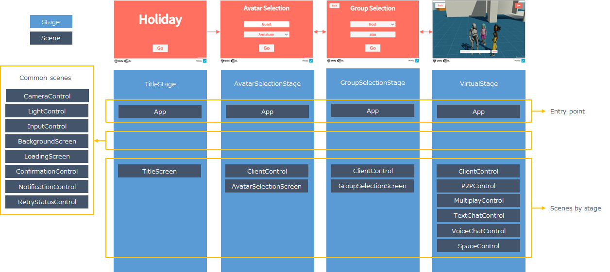

# Architecture

## System Structure

Users use the application from a browser.
Assets such as 3D models and connection information to the server are not included in the application, but are downloaded from S3 when the application is run.
The application connects directly to the server for processing.
Text/voice chat and multiplayer use P2P to exchange data between applications.

## Application Structure

The application architecture of Holiday will be the [architecture](../intro.md#application) assumed by Extreal.
The stages and scenes of Holiday are as follows.

The App scene is explained here because it is a special scene, not a separate feature offering.

The App scene is the entry point for the application.
The App scene handles the application initialization process, stage configuration, application state provision, and other processing related to the application as a whole.
