# Core

ここでは[Core](../category/core)について学習します。

- 学習時間の目安
  - 60分
- Unityバージョン
  - 2021.3.20f1

プロジェクトの作成からCoreの機能を導入していき、VContainerやUniRxも導入しExtrealが想定するアプリケーションアーキテクチャを構築します。

## Create project

:::info step
まずはプロジェクトを作りましょう。
:::

Unity Hubから新しいプロジェクトを作成します。

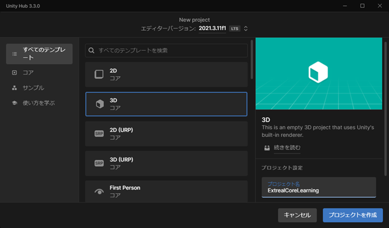

- エディターバージョン: `2021.3.20f1`
- テンプレート: `3D`
- プロジェクト名: `ExtrealCoreLearning`

:::info step
Unityエディタが起動したら実行して問題がないことを確認します。
:::

SampleSceneを実行してみましょう。
シーンに何も配置していないので何も起こりません。
Consoleに何も出ていなければ成功です。

## Create entry point

:::info step
アプリケーション用のディレクトリとエントリーポイントとなるAppシーンを作ります。
:::

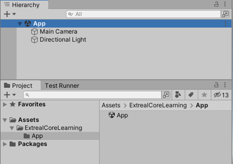

- 初期設定してある`Assets/Scenes`ディレクトリを削除します。
- `Assets/ExtrealCoreLearning/App`となるディレクトリを作ります。
- Appディレクトリに`App`シーンを作成します。

## Add Logging

[Logging](../core/logging.md)をアプリケーションに追加します。

:::info step
Package ManagerからLoggingを追加します。
:::

Git URL指定でLoggingを追加します。
Git URLは[LoggingのPackage](../core/logging.md#package)から取得します。


Package Managerに`Extreal.Core.Logging`が追加されれば成功です。
バージョンは実施タイミングにより異なります。

:::info step
スクリプトからLoggingを参照できるようにします。
:::

アプリケーションのAssembly DefinitionにLoggingを設定します。


- ExtrealCoreLearningディレクトリに`ExtrealCoreLearning`という名前のAssembly Definitionを作成します。
- Root Namespaceに`ExtrealCoreLearning`を指定します。
- Assembly Definition Referencesに`Extreal.Core.Logging`を追加します。
- Assembly Definition ReferencesのUse GUIDsのチェックは外します。

:::info step
開発用にDebugレベルのログを出力したいのでLoggingの設定を追加します。
:::

LoggingのデフォルトのログレベルはInfoのため、Loggingの設定を追加してログレベルを変更します。

[LoggingのSettings](../core/logging.md#settings)を参考にして`AppTest`スクリプトをAppシーンに作成します。

- AppTestスクリプトをAppディレクトリに作成します。
- AppTestスクリプトをアタッチしたGameObjectをAppシーンに作成します。

```csharp
using Extreal.Core.Logging;
using UnityEngine;

namespace ExtrealCoreLearning.App
{
    public class AppTest : MonoBehaviour
    {
        private static void InitializeApp()
        {
            const LogLevel logLevel = LogLevel.Debug;
            LoggingManager.Initialize(logLevel: logLevel);
        }

        private void Awake()
        {
            InitializeApp();
        }
    }
}
```

:::info step
このままではLoggingの動作確認ができないので、Loggingの初期化直後にログ出力するように処理を追加します。
:::

```csharp
private static void InitializeApp()
{
    const LogLevel logLevel = LogLevel.Debug;
    LoggingManager.Initialize(logLevel: logLevel);

    // highlight-start
    var logger = LoggingManager.GetLogger(nameof(AppTest));
    if (logger.IsDebug())
    {
        logger.LogDebug("Hello, world!");
    }
    // highlight-end
}
```

Appシーンを実行してみましょう。
Consoleに`Hello, world!`と出力されれば成功です。


## Add Stage Navigation

[Stage Navigation](../core/stage-navigation.md)をアプリケーションに追加します。

:::info step
Stage Navigationは[UniTask](https://github.com/Cysharp/UniTask)と[UniRx](https://github.com/neuecc/UniRx)に依存しているため先にUniTaskとUniRxを追加します。
:::

UniTaskとUniRxは[OpenUPM](https://openupm.com/)で提供されているためOpenUPMの設定を追加します。
`Edit` -> `Project Settings...` -> `Package Manager`からScoped RegistriesにOpenUPMを追加します。

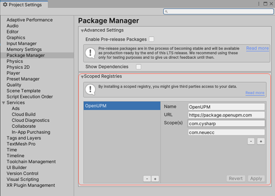

- Name:
  ```text
  OpenUPM
  ```
- URL:
  ```text
  https://package.openupm.com
  ```
- Scope(s):
  - UniTask
    ```text
    com.cysharp
    ```
  - UniRx
    ```text
    com.neuecc
    ```

:::info step
UniTaskとUniRxを追加できたのでStage Navigationをスクリプトから使えるようにします。
:::

Stage Navigationは[Common](../core/common.md)に依存してるのでCommonも追加します。

Loggingの時と同じ手順でPackage ManagerとAssembly Definitionを操作します。
CommonとStage NavigationのGit URLは[CommonのPackage](../core/common.md#package)と[Stage NavigationのPackage](../core/stage-navigation.md#package)から取得します。
Assembly DefinitionにUniTaskとUniRxも設定します。

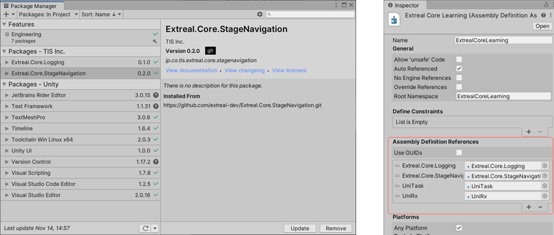

ステージ遷移を試すためタイトル画面を追加し、アプリ起動後すぐにタイトル画面に遷移させてみましょう。

:::info step
まずはタイトル画面を追加します。
:::

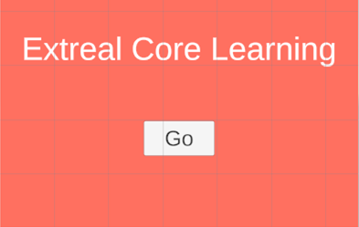

- Appディレクトリと同じ階層に`TitleScreen`ディレクトリを作成します。
- その中に`TitleScreen`シーンを作成します。
- TitleScreenシーンのカメラなど初期設定されているGameObjectを削除しシーンを一旦空にします。
- シーンに`Canvas`を追加します。インスペクタで次の設定をします。
  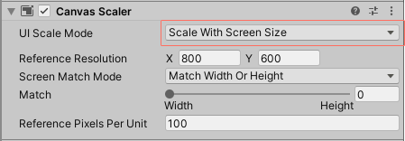
  - Canvas Scaler
    - UI Scale Mode: `Scale With Screen Size`
- Canvasの下に`Image`を追加します。インスペクタで次の設定をします。
  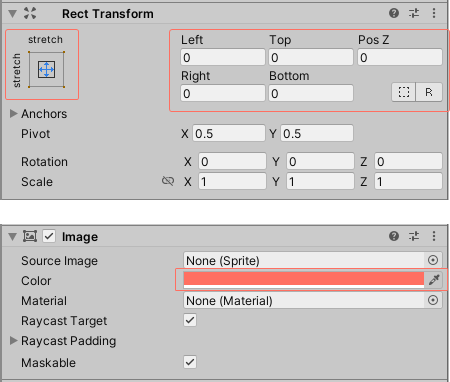
  - Rect Transform
    - Anchor Presets
      - X: `stretch`
      - Y: `stretch`
    - LeftからButtomまで全て`0（Zero）`
  - Image
    - Color
      - Hexadecimal: `FF6F61`
- Imageの下に`Text - TextMeshPro`を追加します。
  - `Extreal Core Learning`というタイトルを作ります。
  - サイズやポジションは自由に決めてください。
  - TMP Importerが表示されたら`Import TMP Essentials`を選択します。TextMeshProの初回利用時のみTMP Importerが表示されます。インポートされたらTMP Importerを閉じます。
- Imageの下に`Button - TextMeshPro`を追加します。
  - `Go`というボタンを作ります。
  - こちらもサイズやポジションは自由に決めてください。

:::info step
タイトル画面を追加できたのでステージ設定を作成します。
:::

[Stage NavigationのSettings](../core/stage-navigation.md#settings)を参照してステージ設定を作成します。
ステージ設定で作成する3つのタイプはAppディレクトリに配置します。

```csharp
public enum StageName
{
    TitleStage = 0,
}
public enum SceneName
{
    TitleScreen = 100,
}
```

3つのタイプが作成できたら`StageConfig`オブジェクトを作ります。


- Assetsメニューから`StageConfig`オブジェクトをAppディレクトリに作成します。
- StageConfigオブジェクトにタイトル画面のステージを設定します。

:::info step
これでステージ遷移の準備が整ったのでアプリ起動後すぐにタイトル画面に遷移させる処理を追加します。
:::

- AppTestスクリプトにSerializeFieldとStartメソッドを追加します。
- インスペクタでStageConfigオブジェクトを指定します。

```csharp
using Extreal.Core.Logging;
// highlight-start
using Extreal.Core.StageNavigation;
// highlight-end
using UnityEngine;

namespace ExtrealCoreLearning.App
{
    public class AppTest : MonoBehaviour
    {
        private static void InitializeApp()
        {
            // Omitted due to no changes
        }

        private void Awake()
        {
            // Omitted due to no changes
        }
        
        // highlight-start
        [SerializeField] private StageConfig stageConfig;

        private void Start()
        {
            var stageNavigator = new StageNavigator<StageName, SceneName>(stageConfig);
            stageNavigator.ReplaceAsync(StageName.TitleStage);
        }
        // highlight-end
    }
}
```

:::info step
Appシーンを実行してみましょう。
:::

この状態でAppシーンを実行すると次のエラーになります。

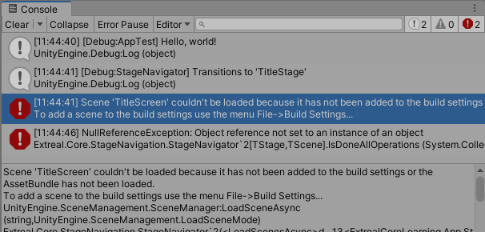

Build SettingsのScenes In Buildに`TitleScreen`シーンを追加します。

:::info step
もう一度Appシーンを実行してみましょう。
:::

タイトル画面が表示され、Consoleに`[Debug:StageNavigator] Transitions to 'TitleStage'`と出ていれば成功です。

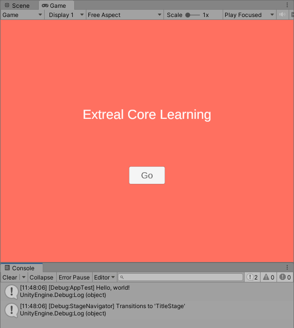

## Apply MV(R)P pattern

Extrealが提供するCoreの機能は以上となりますが、[VContainer](https://vcontainer.hadashikick.jp/)を追加して[Extrealが想定するアプリケーションアーキテクチャ](../intro.md#application)に近づけていきたいと思います。

:::info step
タイトル画面の遷移先となるアバター選択画面を追加します。
:::

アバター選択画面は遷移先として使用するだけなのでタイトル画面をコピーして作ります。

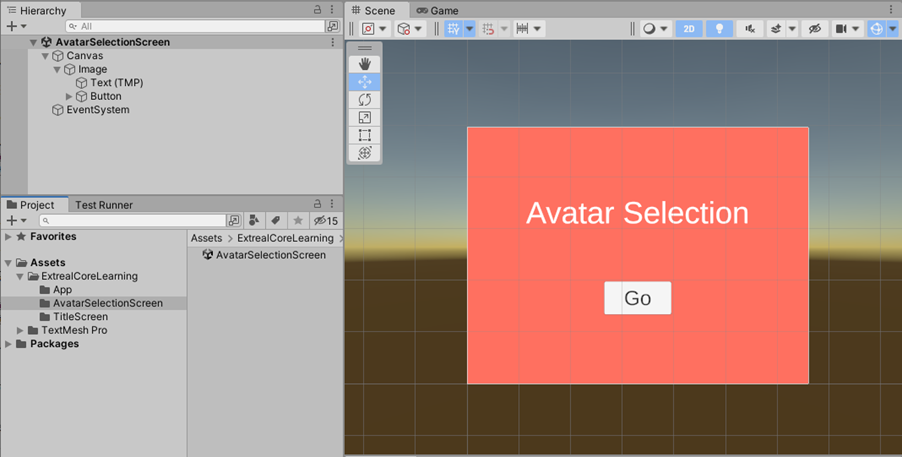

- Appディレクトリと同じ階層に`AvatarSelectionScreen`ディレクトリを作成します。
- その中に`AvatarSelectionScreen`シーンを作成します。
- AvatarSelectionScreenシーンのカメラなど初期設定されているGameObjectを削除しシーンを一旦空にします。
- TitleScreenシーンのCanvasとEventSystemをコピーしてAvatarSelectionScreenシーンにペーストします。
- タイトルを`Avatar Selection`に変更します。

:::info step
続けてステージ設定を追加します。
:::


- StageNameに`AvatarSelectionStage`、SceneNameに`AvatarSelectionScreen`を追加します。
- StageConfigオブジェクトのインスペクタで`AvatarSelectionStage`を追加します。

Build SettingsのScenes In Buildに`AvatarSelectionScreen`シーンを追加します。

UIとステージ設定の準備が整いました。

:::info step
VContainerをアプリケーションに追加します。
:::

VContainerはUniTaskやUniRxと同様にOpenUPMから取得します。

`Edit` -> `Project Settings...` -> `Package Manager`からOpenUPMのScope(s)を追加します。


- VContainer:
  ```text
  jp.hadashikick
  ```

:::info step
続けてPackage ManagerとAssembly DefinitionにVContainerを追加します。
:::

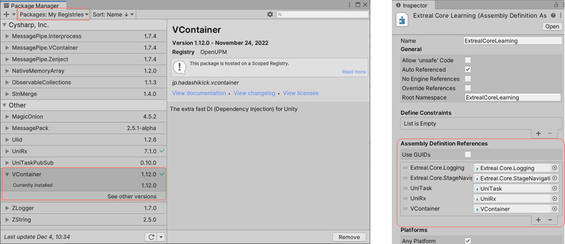

- Package ManagerでPackages: `My Registries`を選択しVContainerをインストールします。
- アプリケーションのAssembly DefinitionにVContainerを設定します。

これでVContainerが使える状態になりました。

### VContainer

VContainerを使って確認用に作成したAppTestを作り変えます。

:::info step
まずエントリーポイントとなるPresenterスクリプトを作成します。
:::

Appディレクトリに作成します。
Appシーンが開始するとタイトル画面に遷移させます。

```csharp
using System.Threading;
using Cysharp.Threading.Tasks;
using Extreal.Core.StageNavigation;
using VContainer.Unity;

namespace ExtrealCoreLearning.App
{
    public class AppPresenter : IAsyncStartable
    {
        private StageNavigator<StageName, SceneName> stageNavigator;

        public AppPresenter(StageNavigator<StageName, SceneName> stageNavigator)
        {
            this.stageNavigator = stageNavigator;
        }

        public async UniTask StartAsync(CancellationToken cancellation)
        {
            await stageNavigator.ReplaceAsync(StageName.TitleStage);
        }
    }
}
```

:::info step
次にVContainerのLifetimeScopeとしてScopeスクリプトを作成します。
:::

Appディレクトリに作成します。
ScopeスクリプトのAwakeをオーバーライドしてVContainerの処理よりも先にLoggingの設定を行います。

```csharp
using Extreal.Core.Logging;
using Extreal.Core.StageNavigation;
using UnityEngine;
using VContainer;
using VContainer.Unity;

namespace ExtrealCoreLearning.App
{
    public class AppScope : LifetimeScope
    {
        [SerializeField] private StageConfig stageConfig;

        private static void InitializeApp()
        {
            const LogLevel logLevel = LogLevel.Debug;
            LoggingManager.Initialize(logLevel: logLevel);

            var logger = LoggingManager.GetLogger(nameof(AppScope));
            if (logger.IsDebug())
            {
                logger.LogDebug("Hello, world!");
            }
        }

        protected override void Awake()
        {
            InitializeApp();
            base.Awake();
        }

        protected override void Configure(IContainerBuilder builder)
        {
            builder.RegisterComponent(stageConfig).AsImplementedInterfaces();
            builder.Register<StageNavigator<StageName, SceneName>>(Lifetime.Singleton);

            builder.RegisterEntryPoint<AppPresenter>();
        }
    }
}
```

StageConfigとStageNavigator、エントリーポイントとしてAppPresenterを登録しています。
この登録により、StageConfigがStageNavigatorに設定され、StageNavigatorがAppPresenterに設定されます。
このようにVContainerが提供するDIコンテナを使ってオブジェクトの構造を作り上げ、各オブジェクトが処理を実行できるようにします。

:::info step
ScopeスクリプトをAppシーンに設定します。
:::


- Appシーンに`Scope`という名前でAppScopeスクリプトをアタッチしたGameObjectを作成します。
- StageConfigオブジェクトをインスペクタで設定します。
- 不要になったのでAppTestスクリプトとAppTestスクリプトをアタッチしたAppシーンのGameObjectを削除します。

Appシーンを実行します。
先ほどと同様にタイトル画面とConsoleのログ出力が出ていれば成功です。

### UniRx

UniRxを使ってタイトル画面のGoボタンを実装します。

:::info step
タイトル画面に対応するViewスクリプトを作成します。
:::

TitleScreenディレクトリに作成します。

```csharp
using System;
using UniRx;
using UnityEngine;
using UnityEngine.UI;

namespace ExtrealCoreLearning.TitleScreen
{
    public class TitleScreenView : MonoBehaviour
    {
        [SerializeField] private Button goButton;

        public IObservable<Unit> OnGoButtonClicked
            => goButton.OnClickAsObservable().TakeUntilDestroy(this);
    }
}
```

UniRxを使ってGoボタンが押された場合にイベントを通知する`OnGoButtonClicked`を定義しています。

:::info step
次にGoボタンが押された場合にアバター選択画面に遷移させるPresenterスクリプトを作成します。
:::

TitleScreenディレクトリに作成します。

```csharp
using Cysharp.Threading.Tasks;
using Extreal.Core.Common.System;
using Extreal.Core.StageNavigation;
using ExtrealCoreLearning.App;
using UniRx;
using VContainer.Unity;

namespace ExtrealCoreLearning.TitleScreen
{
    public class TitleScreenPresenter : DisposableBase, IInitializable
    {
        private StageNavigator<StageName, SceneName> stageNavigator;

        private TitleScreenView titleScreenView;

        private CompositeDisposable compositeDisposable = new CompositeDisposable();

        public TitleScreenPresenter(StageNavigator<StageName, SceneName> stageNavigator,
            TitleScreenView titleScreenView)
        {
            this.stageNavigator = stageNavigator;
            this.titleScreenView = titleScreenView;
        }

        public void Initialize()
        {
            titleScreenView.OnGoButtonClicked.Subscribe(_ =>
            {
                stageNavigator.ReplaceAsync(StageName.AvatarSelectionStage).Forget();
            }).AddTo(compositeDisposable);
        }

        protected override void ReleaseManagedResources()
        {
            compositeDisposable?.Dispose();
        }
    }
}
```

Goボタンのイベント通知とアバター選択画面への遷移をマッピングしています。

Disposeを行うクラスには[Dispose Pattern](https://learn.microsoft.com/en-us/dotnet/standard/garbage-collection/implementing-dispose)の実装が推奨されています。
Dispose Patternを適用するため、TitleScreenPresenterはCommonが提供するDisposableBaseクラスを継承し、ReleaseManagedResourcesメソッドにマネージドリソースの解放処理を実装しています。
Dispose Patternの適用方法は[Common](../core/common.md#core-common-dp)を参照してください。

:::info step
最後にViewやPresenterを紐づけるScopeスクリプトを作成します。
:::

TitleScreenディレクトリに作成します。

```csharp
using UnityEngine;
using VContainer;
using VContainer.Unity;

namespace ExtrealCoreLearning.TitleScreen
{
    public class TitleScreenScope : LifetimeScope
    {
        [SerializeField] private TitleScreenView titleScreenView;

        protected override void Configure(IContainerBuilder builder)
        {
            builder.RegisterComponent(titleScreenView);

            builder.RegisterEntryPoint<TitleScreenPresenter>();
        }
    }
}
```

ViewスクリプトとScopeスクリプトをTitleScreenシーンに設定します。


- TitleScreenシーンに`View`という名前でTitleScreenViewスクリプトをアタッチしたGameObjectを作成します。
- Buttonオブジェクトをインスペクタで設定します。
- TitleScreenシーンに`Scope`という名前でTitleScreenScopeスクリプトをアタッチしたGameObjectを作成します。
- Viewオブジェクトをインスペクタで設定します。

:::info step
Appシーンを実行してみましょう。
:::

この状態でAppシーンを実行すると次のエラーになります。


TitleScreenPresenterにStageNavigatorを設定していますがスコープに登録されていないためエラーとなっています。
StageNavigatorはAppScope、TitleScreenPresenterはTitleScreenScopeと異なるスコープのためこのエラーが発生しています。

VContainerではスコープの親を指定してオブジェクトの検索範囲を親まで広げることができます。
TitleScreenScopeのインスペクタでParentにAppScopeを指定するとこのエラーが解消します。


このようにスコープは階層を意識して作成します。
共通利用されるスコープをより親となるように全体のスコープを設計します。

:::info step
もう一度Appシーンを実行してみましょう。
:::

タイトル画面からアバター選択画面に遷移できれば成功です。

## Next Step

これでCoreのハンズオンは終了です。
お疲れさまでした。

このハンズオンを通じて[Extrealが想定するアプリケーションアーキテクチャ](../intro.md#application)に必要な機能を構築済みです。
次のステップとしてハンズオンで構築したアーキテクチャがより本格的なアプリケーションでどのように使われるのか関心があると思います。
その期待に応えるため、より本格的な実装例として[Sample Application](../category/sample-application)を提供しています。
ぜひSample Applicationをご覧ください。
