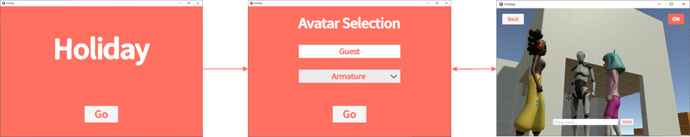

# Requirements

ここではHolidayで実現している要件を示します。

:::caution
Holidayの要件は本番運用するアプリケーションに必要な要件を網羅していません。
本番運用するアプリケーションの場合は[非機能要求グレード](https://www.ipa.go.jp/sec/softwareengineering/std/ent03-b.html)を参考に非機能要件の観点を洗い出して要件定義を実施してください。
:::

## Functional requirements

Holidayは友人や家族で集まって休日のひと時を過ごしてもらうことを目指したアプリケーションです。

- タイトル画面
  - タイトル表示のみ
- アバター選択画面
  - 名前を入力できる
  - アバターを選択できる
    - [Starter Assets - Third Person Character Controller](https://assetstore.unity.com/packages/essentials/starter-assets-third-person-character-controller-196526)のArmature
    - [Mixamo](https://www.mixamo.com)のMichelle、Amy
- バーチャル空間
  - ボイスチャットができる
  - テキストチャットができる
  - マルチプレイができる
  - アバター選択画面に戻れる

## Non-functional requirements

- 開催方法
  - 1回あたり1時間、日程を決めてイベント告知して開催する。
  - 開催のたびにサーバーを起動/停止する。
- 利用人数
  - タイトル画面、アバター選択画面
    - 制限なし
  - バーチャル空間
    - 最大人数90人
    - 最大人数を超えた場合はアバター選択画面でユーザーに通知する。
- 利用環境
  - PC
    - Windows 10
    - 解像度：1920x1080
  - モバイル
    - iOS 16
    - Android 11
    - 解像度：1080x1920（ポートレートモード）
  - インターネット回線
    - 上り/下り 40Mbps以上
  - 周辺機器
    - マイク付き有線イヤホン
- アセット
  - アセットはアプリケーションに含めず、アプリケーションの実行時にダウンロードする。
    - アバターのキャラクタやバーチャル空間等のモデル、タイトルやメッセージ等のテキストなど
    - アセットのダウンロードはダウンロードサイズを表示してユーザーに実行確認を行う。
- 外部接続
  - アセットのダウンロード（S3）
    - ネットワーク切断時は再接続を行う。
      - 再接続状況はユーザーに通知する。
      - 再接続が失敗した場合、さらに再接続したい場合はユーザー操作（画面遷移）で行う。
  - Vivox（SaaS）
    - ネットワーク切断時はユーザーに通知し、再接続を行う。
      - 再接続状況はユーザーに通知する。
      - 再接続が失敗した場合、さらに再接続したい場合はユーザー操作（バーチャル空間に再入室する）で行う。
    - テキスト/ボイスチャット以外の機能は使用できる。
  - マルチプレイサーバー
    - ネットワーク切断時はユーザーに通知し、再接続を行う。
      - 再接続状況はユーザーに通知する。
      - 再接続が失敗した場合、さらに再接続したい場合はユーザー操作（バーチャル空間に再入室する）で行う。
    - マルチプレイ以外の機能は使用できる。
- 地域、言語
  - 日本、日本語のみ

<!--
    - マルチプレイ
      - 最大人数まではマルチプレイに参加できる
        - 自分が全員に表示される
      - 最大人数を超えた場合は待機人数までは待機状態となりマルチプレイに参加できない
        - 自分が非表示、最大人数までの様子は見える
        - 待機状態、他の人から見えていないことをユーザに通知
        - 他の人が抜けて順番が回ってくるとマルチプレイに参加できる
        - マルチプレイに参加したことをユーザに通知
      - 待機人数を超えた場合はステージにアクセスできない
        - 人数オーバーでアクセスできないことをユーザに通知
    - テキストチャット
      - 待機人数を含めた全員が使用できる
    - ボイスチャット
      - 待機人数を含めた全員が使用できる
-->