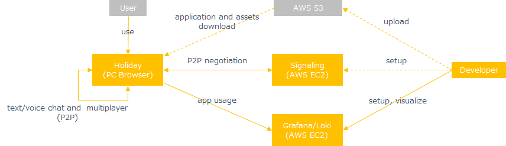
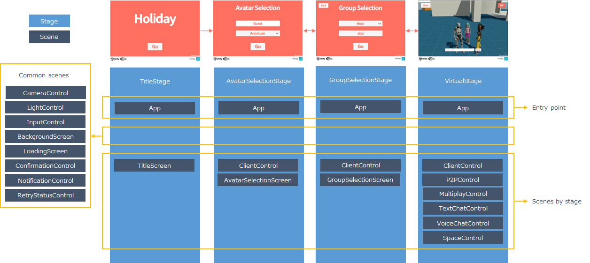

# Architecture

## System Structure

ユーザはブラウザからアプリケーションを使用します。
3Dモデルなどのアセットやサーバーへの接続情報はアプリケーションに含めず、アプリケーションの実行時にS3からダウンロードします。
アプリケーションは直接処理に必要なサーバに接続します。
テキスト/ボイスチャットとマルチプレイはP2Pを使ってアプリケーション間でデータをやりとりします。

## Application Structure

HolidayのアプリケーションアーキテクチャはExtrealが想定している[アーキテクチャ](../intro.md#application)を採用します。
Holidayのステージとシーンは次の通りです。

Appシーンは個別の機能提供でなく、特別なシーンなのでここで説明します。

Appシーンがアプリケーションのエントリーポイントになります。
Appシーンではアプリケーションの初期化処理、ステージ構成やアプリケーション状態の提供など、アプリケーション全体に関わる処理を行います。
